# OpenSearch Index Manager - Architecture Documentation

This document describes the technical architecture of the OpenSearch Index Manager plugin for OpenSearch Dashboards.

## Table of Contents

- [Overview](#overview)
- [System Architecture](#system-architecture)
- [Component Diagrams](#component-diagrams)
- [Data Flow](#data-flow)
- [API Documentation](#api-documentation)
- [Plugin Integration Points](#plugin-integration-points)
- [Security Architecture](#security-architecture)
- [Performance Considerations](#performance-considerations)

## Overview

The OpenSearch Index Manager is a client-server plugin for OpenSearch Dashboards that provides a user interface for CRUD operations on OpenSearch indices. It follows the standard OSD plugin architecture with clear separation between client (public) and server components.

### Key Design Principles

1. **Separation of Concerns**: Clear boundaries between UI, API, and data layers
2. **Type Safety**: Full TypeScript implementation with comprehensive type definitions
3. **Error Resilience**: Comprehensive error handling at all layers
4. **Performance**: Efficient data fetching and rendering strategies
5. **Extensibility**: Plugin architecture allows for easy extension

## System Architecture

### High-Level Architecture

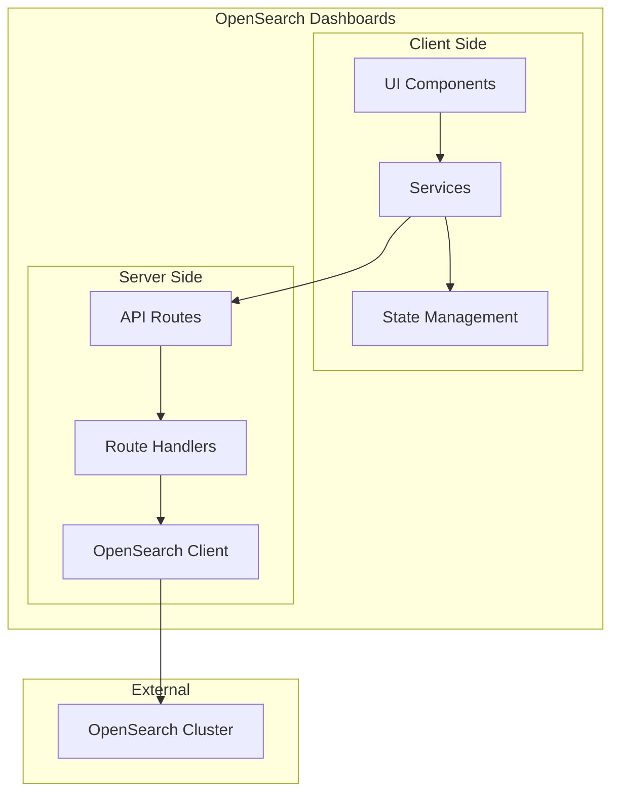

### Plugin Architecture

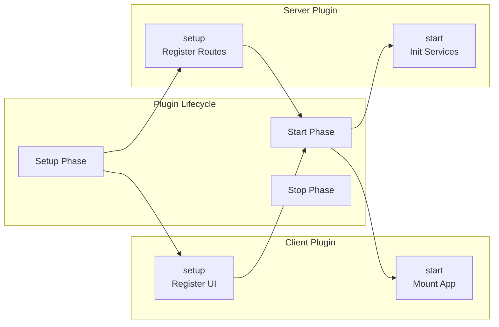

## Component Diagrams

### Client-Side Components

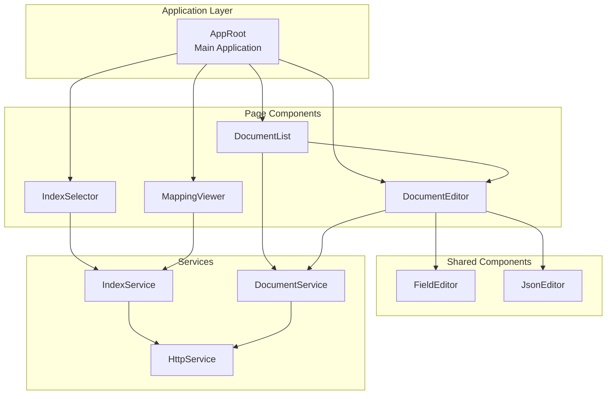

### Server-Side Components

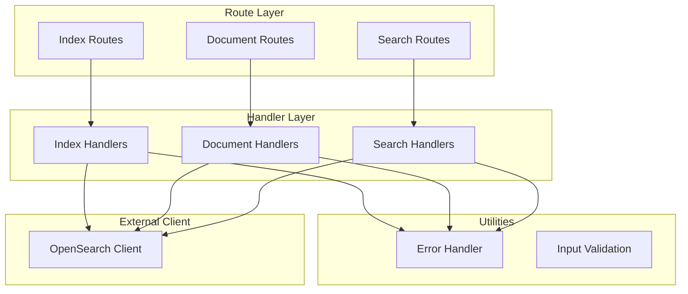

## Data Flow

### Document Creation Flow

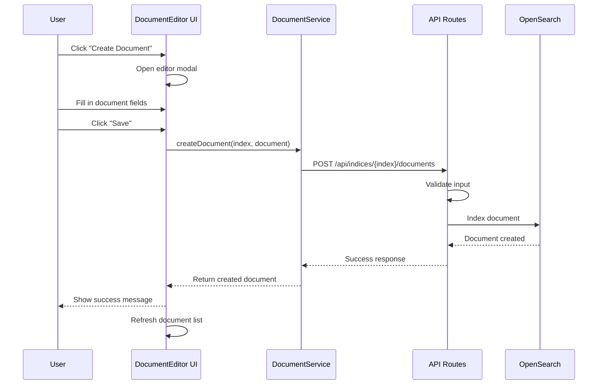

### Document Update Flow with Nested Fields

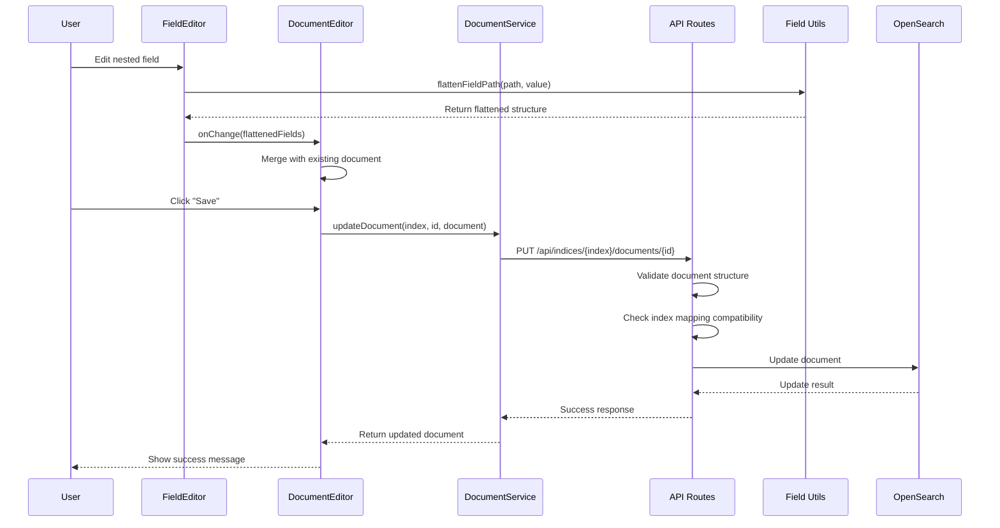

### Index Selection Flow

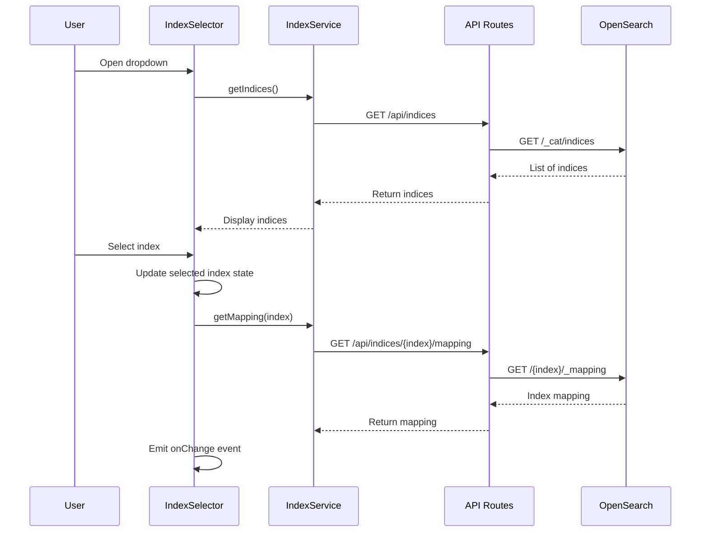

## API Documentation

### REST API Endpoints

#### Index Operations

| Method | Endpoint | Description | Request | Response |
|--------|----------|-------------|---------|----------|
| GET | `/api/opensearch_index_manager/indices` | List all indices | - | `IndexListResponse` |
| GET | `/api/opensearch_index_manager/indices/{index}/mapping` | Get index mapping | - | `IndexMappingResponse` |
| GET | `/api/opensearch_index_manager/indices/{index}/settings` | Get index settings | - | `IndexSettingsResponse` |

#### Document Operations

| Method | Endpoint | Description | Request Body | Response |
|--------|----------|-------------|--------------|----------|
| GET | `/api/opensearch_index_manager/indices/{index}/documents` | List documents | Query params: `from`, `size`, `search` | `DocumentListResponse` |
| GET | `/api/opensearch_index_manager/indices/{index}/documents/{id}` | Get document | - | `DocumentResponse` |
| POST | `/api/opensearch_index_manager/indices/{index}/documents` | Create document | `CreateDocumentRequest` | `DocumentResponse` |
| PUT | `/api/opensearch_index_manager/indices/{index}/documents/{id}` | Update document | `UpdateDocumentRequest` | `DocumentResponse` |
| DELETE | `/api/opensearch_index_manager/indices/{index}/documents/{id}` | Delete document | - | `DeleteResponse` |

#### Search Operations

| Method | Endpoint | Description | Request Body | Response |
|--------|----------|-------------|--------------|----------|
| POST | `/api/opensearch_index_manager/indices/{index}/search` | Search with DSL | `SearchRequest` | `SearchResponse` |
| POST | `/api/opensearch_index_manager/indices/{index}/query` | Simple query | `QueryRequest` | `SearchResponse` |

### Type Definitions

```typescript
// Document Types
interface Document {
  _id: string;
  _index: string;
  _source: Record<string, unknown>;
  _version?: number;
}

interface DocumentListResponse {
  documents: Document[];
  total: number;
  took: number;
}

// Index Types
interface Index {
  name: string;
  health: 'green' | 'yellow' | 'red';
  status: 'open' | 'close';
  docsCount: number;
  storeSize: string;
}

interface IndexMapping {
  properties: Record<string, MappingProperty>;
}

interface MappingProperty {
  type: string;
  properties?: Record<string, MappingProperty>;
  fields?: Record<string, MappingProperty>;
}

// Request/Response Types
interface CreateDocumentRequest {
  document: Record<string, unknown>;
  id?: string;
}

interface SearchRequest {
  query: QueryDsl;
  from?: number;
  size?: number;
  sort?: SortOptions[];
}

interface SearchResponse {
  hits: {
    total: { value: number; relation: string };
    hits: Document[];
  };
  took: number;
  timed_out: boolean;
}
```

## Plugin Integration Points

### Required Plugins

The plugin depends on the following OSD core plugins:

| Plugin | Purpose | Usage |
|--------|---------|-------|
| `navigation` | Side navigation | Register plugin in left sidebar |
| `data` | Data services | Search capabilities, index patterns |

### Optional Plugins

| Plugin | Purpose | Usage |
|--------|---------|-------|
| `securityDashboards` | Security integration | Respect user permissions |
| `dataSource` | Multi-data source | Support for multiple OpenSearch clusters |

### Required Bundles

| Bundle | Purpose |
|--------|---------|
| `opensearchDashboardsUtils` | OSD utilities |
| `opensearchDashboardsReact` | React components and hooks |

### Integration Diagram

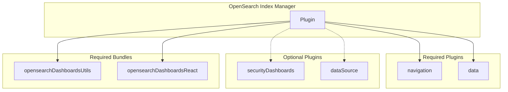

## Security Architecture

### Authentication & Authorization

The plugin relies on OSD's built-in security mechanisms:

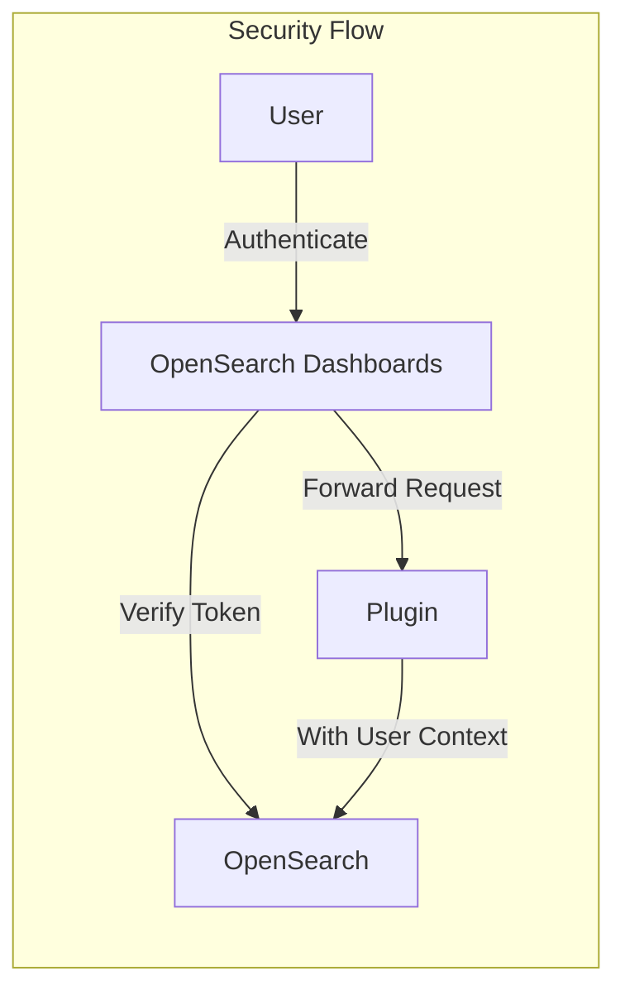

### Security Measures

1. **Input Validation**: All API inputs are validated using schemas
2. **Output Sanitization**: All outputs are sanitized to prevent XSS
3. **Error Handling**: Error messages don't leak sensitive information
4. **CSRF Protection**: Handled by OSD framework
5. **CORS**: Configured through OSD settings

### Permission Model

The plugin respects OpenSearch index-level permissions:

| Operation | Required Permission |
|-----------|---------------------|
| List indices | `indices:monitor/stats` |
| Read documents | `read` on index |
| Write documents | `write` on index |
| Delete documents | `delete` on index |

## Performance Considerations

### Client-Side Optimizations

1. **Virtual Scrolling**: For large document lists
2. **Debounced Search**: Search input debounced to reduce API calls
3. **Lazy Loading**: Components loaded on demand
4. **Memoization**: React.memo for expensive renders
5. **Pagination**: Server-side pagination for large datasets

### Server-Side Optimizations

1. **Query Optimization**: Efficient OpenSearch queries
2. **Caching**: Mapping information cached where appropriate
3. **Batch Operations**: Bulk operations where supported
4. **Connection Pooling**: Reuse OpenSearch connections

### Performance Metrics

| Metric | Target | Current |
|--------|--------|---------|
| Initial Load | < 2s | TBD |
| Document List (100 docs) | < 500ms | TBD |
| Document Save | < 1s | TBD |
| Search Response | < 500ms | TBD |

### Scalability Considerations

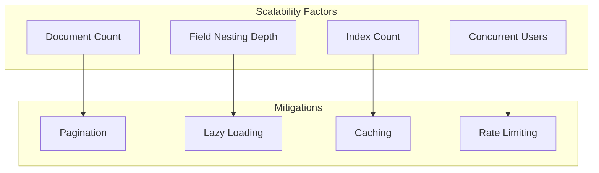

## Data Models

### Document Model

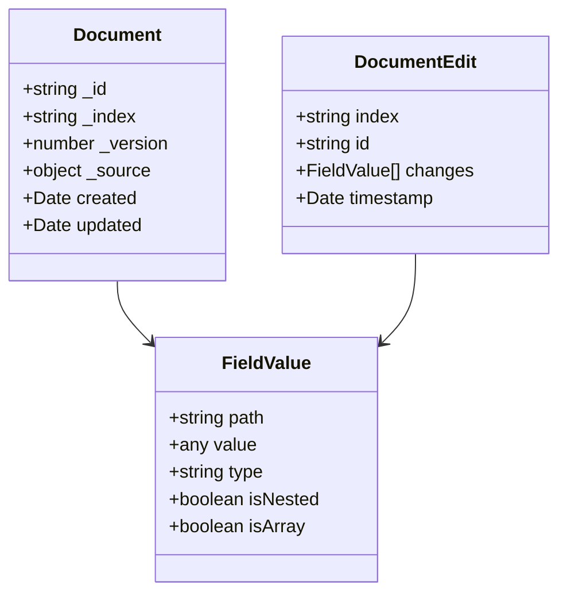

### Index Model

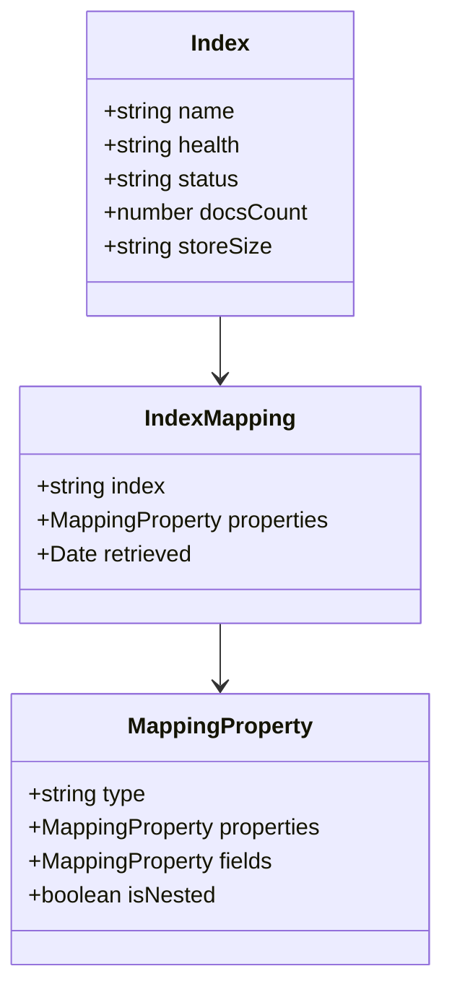

---

*This architecture documentation is maintained alongside the codebase. For the most current information, refer to the source code and inline documentation.*