# OpenSearch Dashboards CRUD Plugin Architecture

## Table of Contents
- [Overview](#overview)
- [Project File Structure](#project-file-structure)
- [Backend Architecture](#backend-architecture)
- [Frontend Architecture](#frontend-architecture)
- [Data Flow Diagrams](#data-flow-diagrams)
- [Security Considerations](#security-considerations)
- [Configuration Schema](#configuration-schema)
- [API Endpoint Specifications](#api-endpoint-specifications)
- [Data Model and Index Mapping](#data-model-and-index-mapping)

---

## Overview

This document defines the complete architecture for a feature-rich CRUD plugin for OpenSearch Dashboards. The plugin provides comprehensive entity management capabilities including:

- **CRUD Operations**: Create, Read, Update, Delete for entities
- **Server-side Pagination**: Efficient handling of large datasets
- **Complex Filtering**: Multi-field filtering with various operators
- **Multi-column Sorting**: Sort by multiple columns simultaneously
- **Input Validation**: Client-side and server-side validation with TypeScript strict typing
- **Bulk Entity Management**: Bulk create, update, and delete operations

### Technical Stack

| Component | Technology |
|-----------|------------|
| Plugin Framework | OpenSearch Dashboards Plugin System |
| Language | TypeScript (strict mode) |
| Frontend | React with OUI (OpenSearch UI) components |
| Backend | Node.js with OpenSearch Dashboards Core APIs |
| Data Persistence | OpenSearch cluster |
| UI Components | OpenSearch Design System (OUI) |

---

## Project File Structure

```
crud-plugin/
|-- opensearch_dashboards.json          # Plugin manifest
|-- tsconfig.json                        # TypeScript configuration
|-- package.json                         # NPM package definition
|-- public/                              # Frontend code
|   |-- index.ts                         # Public plugin entry point
|   |-- plugin.ts                        # Frontend plugin class
|   |-- types/                           # TypeScript type definitions
|   |   |-- index.ts                     # Type exports
|   |   |-- entity.types.ts              # Entity-related types
|   |   |-- api.types.ts                 # API request/response types
|   |   |-- filter.types.ts              # Filtering and sorting types
|   |   |-- validation.types.ts          # Validation types
|   |-- components/                      # React components
|   |   |-- index.ts                     # Component exports
|   |   |-- app/                         # Main application component
|   |   |   |-- app.tsx                  # Main app container
|   |   |   |-- app.scss                 # App styles
|   |   |-- entity_list/                 # Entity listing component
|   |   |   |-- index.ts                # Component exports
|   |   |   |-- entity_list.tsx         # Main list component
|   |   |   |-- entity_list.scss        # List styles
|   |   |   |-- entity_table.tsx        # Table component
|   |   |   |-- entity_table_row.tsx    # Table row component
|   |   |   |-- bulk_actions_bar.tsx   # Bulk operations toolbar
|   |   |-- entity_form/                # Entity create/edit form
|   |   |   |-- index.ts                # Component exports
|   |   |   |-- entity_form.tsx         # Main form component
|   |   |   |-- entity_form.scss        # Form styles
|   |   |   |-- form_field.tsx          # Generic form field wrapper
|   |   |   |-- validation_message.tsx  # Validation error display
|   |   |-- filters/                    # Filtering components
|   |   |   |-- index.ts                # Component exports
|   |   |   |-- filter_bar.tsx          # Filter toolbar
|   |   |   |-- filter_popover.tsx      # Filter configuration popover
|   |   |   |-- filter_pill.tsx         # Active filter display
|   |   |   |-- date_range_filter.tsx   # Date range filter
|   |   |   |-- text_filter.tsx         # Text search filter
|   |   |   |-- select_filter.tsx       # Dropdown select filter
|   |   |-- pagination/                 # Pagination components
|   |   |   |-- index.ts                # Component exports
|   |   |   |-- pagination_bar.tsx      # Pagination toolbar
|   |   |   |-- page_size_selector.tsx  # Items per page selector
|   |   |-- sorting/                    # Sorting components
|   |   |   |-- index.ts                # Component exports
|   |   |   |-- sort_indicator.tsx      # Column sort indicator
|   |   |   |-- multi_sort_controls.tsx # Multi-column sort UI
|   |   |-- common/                     # Shared UI components
|   |       |-- index.ts                # Component exports
|   |       |-- loading_spinner.tsx     # Loading indicator
|   |       |-- confirmation_dialog.tsx # Confirmation modal
|   |       |-- error_boundary.tsx      # Error handling wrapper
|   |       |-- toast_notification.tsx  # Toast notifications
|   |-- services/                       # Frontend services
|   |   |-- index.ts                    # Service exports
|   |   |-- entity_service.ts           # Entity CRUD API client
|   |   |-- filter_service.ts           # Filter state management
|   |   |-- validation_service.ts       # Client-side validation
|   |-- hooks/                          # Custom React hooks
|   |   |-- index.ts                    # Hook exports
|   |   |-- use_entity_list.ts          # Entity list state management
|   |   |-- use_entity_form.ts          # Form state management
|   |   |-- use_filters.ts              # Filter state management
|   |   |-- use_pagination.ts           # Pagination state management
|   |   |-- use_sorting.ts              # Sorting state management
|   |   |-- use_bulk_operations.ts      # Bulk operations state
|   |   |-- use_toast.ts                 # Toast notifications
|   |-- context/                        # React context providers
|   |   |-- index.ts                    # Context exports
|   |   |-- entity_context.tsx          # Entity state context
|   |   |-- toast_context.tsx            # Toast notification context
|   |-- utils/                          # Utility functions
|       |-- index.ts                    # Utility exports
|       |-- query_builder.ts            # OpenSearch query builder
|       |-- filter_utils.ts             # Filter transformation utils
|       |-- sort_utils.ts               # Sort transformation utils
|       |-- validation_utils.ts         # Validation helper functions
|-- server/                              # Backend code
|   |-- index.ts                         # Server plugin entry point
|   |-- plugin.ts                        # Server plugin class
|   |-- types/                           # Server type definitions
|   |   |-- index.ts                     # Type exports
|   |   |-- entity.types.ts              # Entity server types
|   |   |-- route.types.ts               # Route handler types
|   |   |-- opensearch.types.ts          # OpenSearch client types
|   |-- routes/                          # HTTP route handlers
|   |   |-- index.ts                     # Route registration
|   |   |-- entity_routes.ts             # Entity CRUD endpoints
|   |   |-- bulk_routes.ts               # Bulk operation endpoints
|   |   |-- validation_routes.ts         # Validation endpoints
|   |-- services/                        # Backend services
|   |   |-- index.ts                     # Service exports
|   |   |-- entity_service.ts            # Entity business logic
|   |   |-- opensearch_client.ts         # OpenSearch client wrapper
|   |   |-- validation_service.ts        # Server-side validation
|   |   |-- bulk_service.ts              # Bulk operations logic
|   |-- utils/                           # Server utilities
|   |   |-- index.ts                     # Utility exports
|   |   |-- query_parser.ts              # Query parsing utilities
|   |   |-- response_formatter.ts        # API response formatting
|   |   |-- error_handler.ts             # Error handling utilities
|   |   |-- sanitization.ts              # Input sanitization
|   |-- saved_objects/                   # Saved objects definitions
|       |-- index.ts                     # Saved objects registration
|       |-- entity_saved_object.ts       # Entity saved object type
|-- config/                              # Configuration files
|   |-- index.ts                         # Configuration exports
|   |-- settings.ts                      # Plugin settings schema
|-- common/                              # Shared code (server + public)
|   |-- index.ts                         # Common exports
|   |-- constants.ts                     # Shared constants
|   |-- validation_rules.ts              # Shared validation rules
|-- test/                                # Test files
    |-- jest.config.js                   # Jest configuration
    |-- public/                          # Frontend tests
    |   |-- components/                  # Component unit tests
    |   |-- services/                   # Service unit tests
    |   |-- hooks/                       # Hook unit tests
    |   |-- integration/                 # Integration tests
    |-- server/                          # Backend tests
        |-- routes/                      # Route handler tests
        |-- services/                    # Service unit tests
        |-- integration/                 # Integration tests
```

---

## Backend Architecture

### Server Plugin Class

The server-side plugin implements the `Plugin` interface from OpenSearch Dashboards core:

```typescript
interface CrudPluginServer
  extends Plugin<
    CrudPluginServerSetupDeps,
    CrudPluginServerStartDeps,
    CrudPluginServerConfig
  > {
  setup(core: CoreSetup, deps: CrudPluginServerSetupDeps): Promise<CrudPluginServerSetup>;
  start(core: CoreStart, deps: CrudPluginServerStartDeps): CrudPluginServerStart;
  stop(): void;
}
```

### Router Design

The plugin registers HTTP routes using the OpenSearch Dashboards router API:

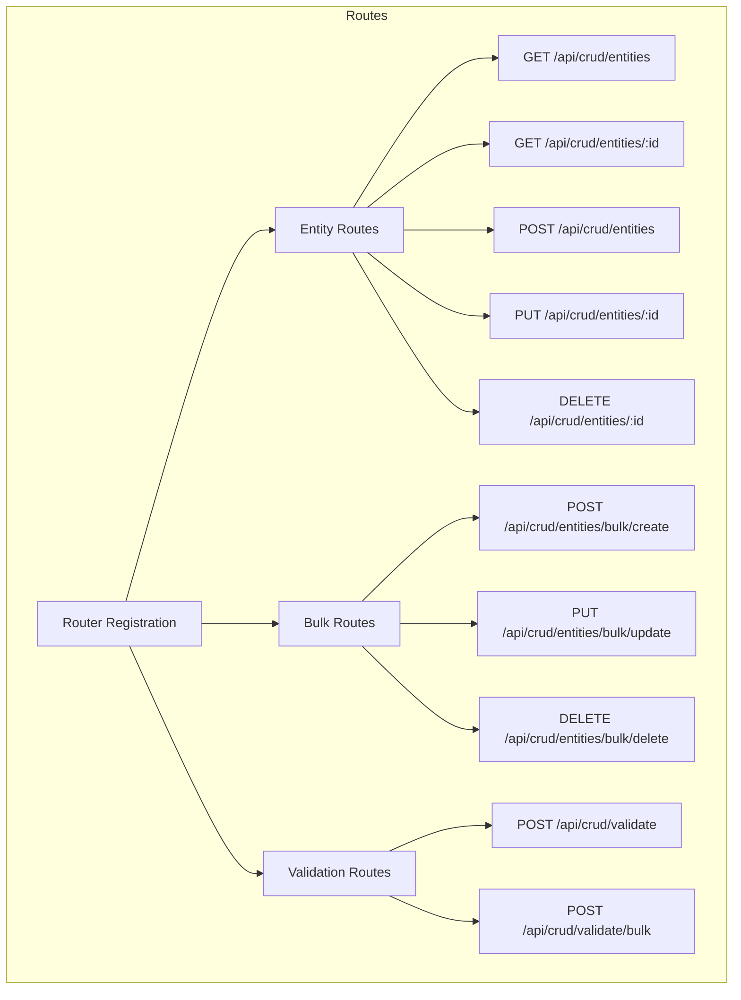

### OpenSearch Cluster Integration

The plugin integrates with the OpenSearch cluster through the core OpenSearch client:

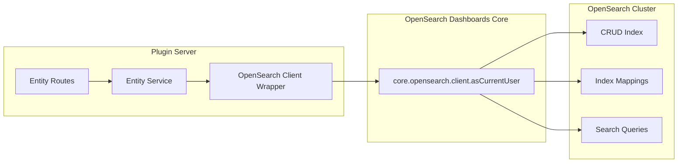

### Service Layer Architecture

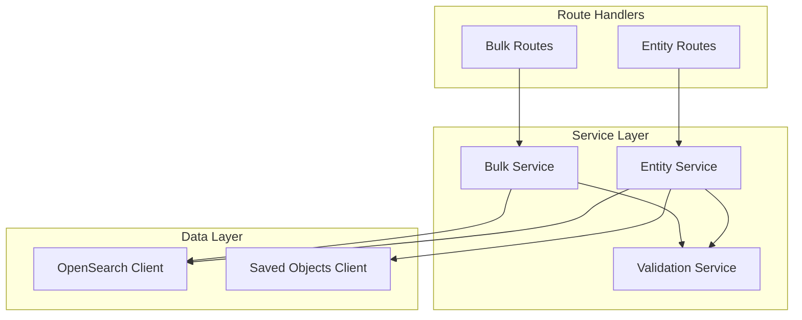

### Entity Service Interface

```typescript
interface EntityService {
  // Single entity operations
  create(entity: CreateEntityRequest): Promise<Entity>;
  getById(id: string): Promise<Entity | null>;
  list(params: ListQueryParams): Promise<PaginatedResult<Entity>>;
  update(id: string, entity: UpdateEntityRequest): Promise<Entity>;
  delete(id: string): Promise<void>;
  
  // Bulk operations
  bulkCreate(entities: CreateEntityRequest[]): Promise<BulkResult<Entity>>;
  bulkUpdate(updates: BulkUpdateRequest[]): Promise<BulkResult<Entity>>;
  bulkDelete(ids: string[]): Promise<BulkDeleteResult>;
  
  // Query building
  buildSearchQuery(params: ListQueryParams): SearchParams;
}
```

---

## Frontend Architecture

### Component Hierarchy

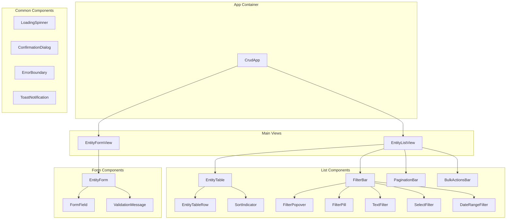

### State Management Approach

The plugin uses React Context API combined with custom hooks for state management:

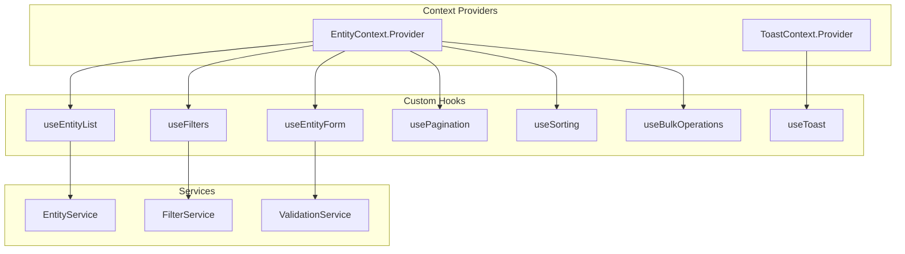

### State Structure

```typescript
interface EntityListState {
  // Data
  entities: Entity[];
  selectedIds: Set<string>;
  totalCount: number;
  
  // Loading states
  isLoading: boolean;
  isCreating: boolean;
  isUpdating: boolean;
  isDeleting: boolean;
  
  // Pagination
  pagination: PaginationState;
  
  // Filtering
  filters: ActiveFilter[];
  filterOptions: FilterOptions;
  
  // Sorting
  sorting: SortField[];
  
  // Errors
  error: ApiError | null;
  validationErrors: ValidationError[];
}

interface PaginationState {
  page: number;
  pageSize: number;
  total: number;
}

interface SortField {
  field: string;
  direction: 'asc' | 'desc';
  priority: number;
}

interface ActiveFilter {
  id: string;
  field: string;
  operator: FilterOperator;
  value: FilterValue;
}
```

### Service Layer Design

```typescript
interface EntityService {
  // CRUD operations
  createEntity(data: CreateEntityRequest): Promise<Entity>;
  getEntity(id: string): Promise<Entity>;
  listEntities(params: ListQueryParams): Promise<PaginatedResult<Entity>>;
  updateEntity(id: string, data: UpdateEntityRequest): Promise<Entity>;
  deleteEntity(id: string): Promise<void>;
  
  // Bulk operations
  bulkCreate(entities: CreateEntityRequest[]): Promise<BulkResult<Entity>>;
  bulkUpdate(updates: BulkUpdateRequest[]): Promise<BulkResult<Entity>>;
  bulkDelete(ids: string[]): Promise<BulkDeleteResult>;
  
  // Validation
  validateEntity(data: CreateEntityRequest | UpdateEntityRequest): Promise<ValidationResult>;
  validateBulk(entities: CreateEntityRequest[]): Promise<ValidationResult[]>;
}
```

---

## Data Flow Diagrams

### Entity List Loading Flow

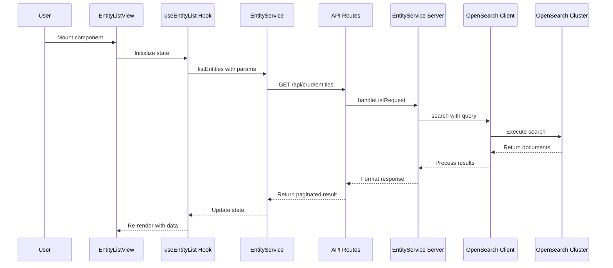

### Entity Creation Flow

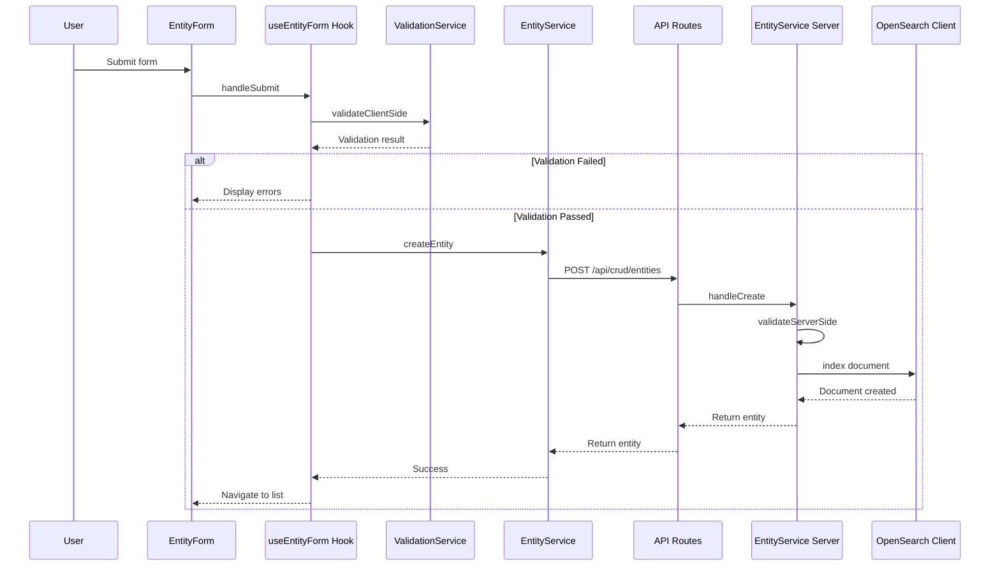

### Bulk Delete Flow

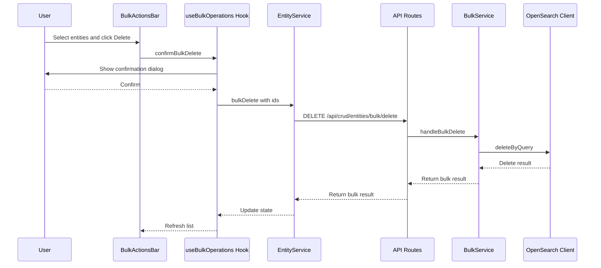

### Filter and Sort Flow

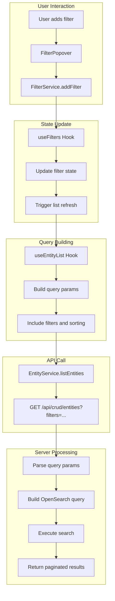

---

## Security Considerations

### Authentication

The plugin leverages OpenSearch Dashboards built-in security:

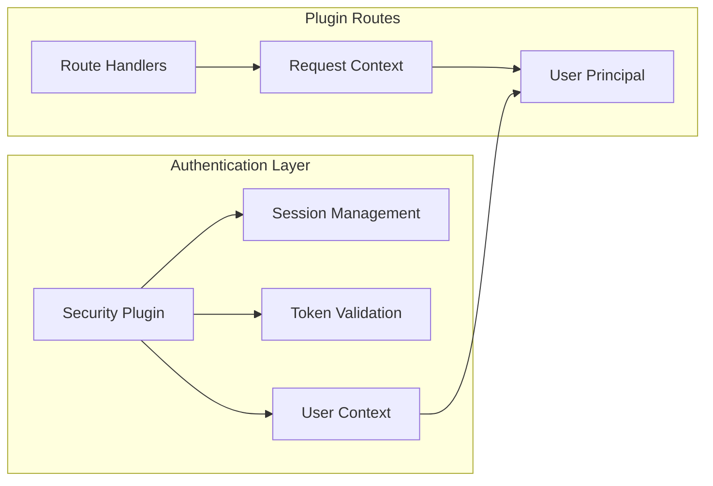

### Authorization

```typescript
// Route-level authorization check
router.get(
  {
    path: '/api/crud/entities',
    validate: { ... },
    options: {
      access: 'crud-plugin:read',  // Required permission
    }
  },
  async (context, request, response) => {
    // Check user permissions
    const user = context.security?.getUser();
    if (!user || !hasPermission(user, 'crud-plugin:read')) {
      return response.forbidden();
    }
    // ... handler logic
  }
);
```

### Permission Model

| Permission | Description |
|------------|-------------|
| `crud-plugin:read` | View entities and list |
| `crud-plugin:create` | Create new entities |
| `crud-plugin:update` | Update existing entities |
| `crud-plugin:delete` | Delete entities |
| `crud-plugin:bulk` | Perform bulk operations |

### Input Sanitization

```typescript
// Server-side sanitization utilities
interface SanitizationService {
  // Sanitize string inputs
  sanitizeString(input: string): string;
  
  // Sanitize object recursively
  sanitizeObject<T>(obj: T): T;
  
  // Escape special characters for OpenSearch queries
  escapeQueryValue(value: string): string;
  
  // Validate and sanitize filter values
  sanitizeFilter(filter: ActiveFilter): SanitizedFilter;
}
```

### Validation Layers

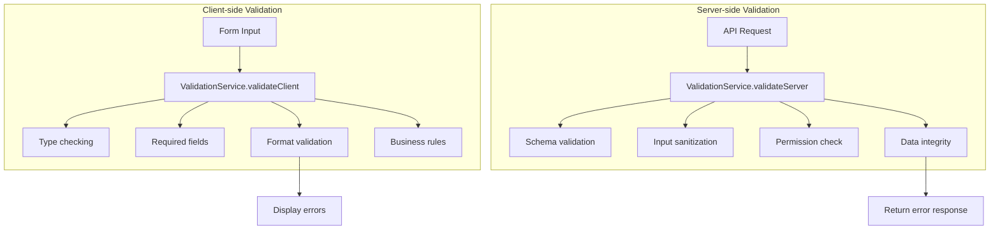

### Security Best Practices

1. **Input Validation**
   - Validate all input on both client and server
   - Use TypeScript strict mode for type safety
   - Implement schema validation using OpenSearch Dashboards schema utilities

2. **Query Injection Prevention**
   - Use parameterized queries for OpenSearch
   - Escape user input in query strings
   - Validate filter operators and field names

3. **CSRF Protection**
   - Leverage OpenSearch Dashboards built-in CSRF protection
   - Include CSRF tokens in state-changing requests

4. **Rate Limiting**
   - Implement rate limiting for API endpoints
   - Configure limits per operation type

5. **Audit Logging**
   - Log all CRUD operations with user context
   - Include operation details and timestamps

---

## Configuration Schema

### Plugin Configuration File

```json
// opensearch_dashboards.json
{
  "id": "crudPlugin",
  "version": "1.0.0",
  "opensearchDashboardsVersion": "3.0.0",
  "server": true,
  "ui": true,
  "requiredPlugins": ["navigation", "data"],
  "optionalPlugins": ["securityDashboards"],
  "requiredBundles": ["opensearchDashboardsReact"]
}
```

### Settings Schema

```typescript
interface CrudPluginConfig {
  // Index configuration
  index: {
    name: string;           // Default: '.crud_entities'
    numberOfShards: number; // Default: 1
    numberOfReplicas: number; // Default: 0
    refreshInterval: string; // Default: '1s'
  };
  
  // Pagination defaults
  pagination: {
    defaultPageSize: number;  // Default: 25
    maxPageSize: number;      // Default: 500
    pageSizeOptions: number[]; // Default: [10, 25, 50, 100]
  };
  
  // Filtering configuration
  filtering: {
    maxFilters: number;       // Default: 10
    enabledOperators: FilterOperator[]; // All operators by default
    debounceMs: number;       // Default: 300
  };
  
  // Sorting configuration
  sorting: {
    maxSortFields: number;    // Default: 3
    defaultSortField: string; // Optional
    defaultSortDirection: 'asc' | 'desc'; // Default: 'asc'
  };
  
  // Bulk operations
  bulk: {
    maxBulkSize: number;      // Default: 100
    enableBulkCreate: boolean; // Default: true
    enableBulkUpdate: boolean; // Default: true
    enableBulkDelete: boolean; // Default: true
  };
  
  // Validation settings
  validation: {
    enableClientValidation: boolean; // Default: true
    enableServerValidation: boolean; // Default: true
    strictMode: boolean;      // Default: true
  };
  
  // Security settings
  security: {
    enableAuditLog: boolean;  // Default: true
    rateLimit: {
      enabled: boolean;       // Default: false
      maxRequests: number;    // Default: 100
      windowMs: number;       // Default: 60000
    };
  };
}
```

### Configuration in opensearch_dashboards.yml

```yaml
# crudPlugin settings
crudPlugin:
  index:
    name: '.crud_entities'
    numberOfShards: 1
    numberOfReplicas: 0
  pagination:
    defaultPageSize: 25
    maxPageSize: 500
  filtering:
    maxFilters: 10
    debounceMs: 300
  sorting:
    maxSortFields: 3
  bulk:
    maxBulkSize: 100
  security:
    enableAuditLog: true
```

---

## API Endpoint Specifications

### Entity Endpoints

#### GET /api/crud/entities

List entities with pagination, filtering, and sorting.

**Query Parameters:**

| Parameter | Type | Description |
|-----------|------|-------------|
| `page` | number | Page number (1-indexed) |
| `pageSize` | number | Items per page |
| `sort` | string | Sort field and direction (e.g., 'name:asc,created:desc') |
| `filters` | JSON string | Array of filter objects |

**Response:**
```json
{
  "entities": [
    {
      "id": "string",
      "version": number,
      "attributes": {
        // Entity fields
      },
      "created_at": "ISO8601 date",
      "updated_at": "ISO8601 date"
    }
  ],
  "total": number,
  "page": number,
  "pageSize": number,
  "hasMore": boolean
}
```

#### POST /api/crud/entities

Create a new entity.

**Request Body:**
```json
{
  "attributes": {
    // Entity fields
  }
}
```

**Response:**
```json
{
  "id": "string",
  "version": number,
  "attributes": {
    // Entity fields
  },
  "created_at": "ISO8601 date"
}
```

#### PUT /api/crud/entities/:id

Update an existing entity.

**Request Body:**
```json
{
  "attributes": {
    // Updated entity fields
  },
  "version": number  // For optimistic locking
}
```

#### DELETE /api/crud/entities/:id

Delete an entity by ID.

### Bulk Endpoints

#### POST /api/crud/entities/bulk/create

Create multiple entities.

**Request Body:**
```json
{
  "entities": [
    { "attributes": { /* fields */ } },
    { "attributes": { /* fields */ } }
  ]
}
```

**Response:**
```json
{
  "success": boolean,
  "created": [
    { "id": "string", "status": "created" }
  ],
  "failed": [
    { "index": number, "error": "string" }
  ],
  "totalCreated": number,
  "totalFailed": number
}
```

#### PUT /api/crud/entities/bulk/update

Update multiple entities.

**Request Body:**
```json
{
  "updates": [
    { "id": "string", "attributes": { /* fields */ } }
  ]
}
```

#### DELETE /api/crud/entities/bulk/delete

Delete multiple entities.

**Request Body:**
```json
{
  "ids": ["id1", "id2", "id3"]
}
```

---

## Data Model and Index Mapping

### Entity Data Model

```typescript
interface Entity {
  id: string;
  version: number;
  
  // Core attributes
  attributes: EntityAttributes;
  
  // Metadata
  created_at: string;  // ISO8601
  updated_at: string;  // ISO8601
  created_by: string;  // User ID
  updated_by: string;  // User ID
}

interface EntityAttributes {
  // User-defined fields
  name: string;
  description?: string;
  status: EntityStatus;
  tags?: string[];
  customFields?: Record<string, unknown>;
}

type EntityStatus = 'active' | 'inactive' | 'archived';
```

### OpenSearch Index Mapping

```json
{
  "mappings": {
    "properties": {
      "id": {
        "type": "keyword"
      },
      "version": {
        "type": "long"
      },
      "attributes": {
        "properties": {
          "name": {
            "type": "text",
            "fields": {
              "keyword": {
                "type": "keyword"
              }
            }
          },
          "description": {
            "type": "text"
          },
          "status": {
            "type": "keyword"
          },
          "tags": {
            "type": "keyword"
          },
          "customFields": {
            "type": "object",
            "enabled": true
          }
        }
      },
      "created_at": {
        "type": "date"
      },
      "updated_at": {
        "type": "date"
      },
      "created_by": {
        "type": "keyword"
      },
      "updated_by": {
        "type": "keyword"
      }
    }
  },
  "settings": {
    "number_of_shards": 1,
    "number_of_replicas": 0,
    "refresh_interval": "1s"
  }
}
```

### Query Building for Filtering

```typescript
// Filter operator to OpenSearch query mapping
const filterOperatorMapping: Record<FilterOperator, QueryBuilder> = {
  eq: (field, value) => ({ term: { [field]: value } }),
  neq: (field, value) => ({ bool: { must_not: [{ term: { [field]: value } }] } }),
  gt: (field, value) => ({ range: { [field]: { gt: value } } }),
  gte: (field, value) => ({ range: { [field]: { gte: value } } }),
  lt: (field, value) => ({ range: { [field]: { lt: value } } }),
  lte: (field, value) => ({ range: { [field]: { lte: value } } }),
  contains: (field, value) => ({ wildcard: { [field]: `*${value}*` } }),
  startsWith: (field, value) => ({ wildcard: { [field]: `${value}*` } }),
  endsWith: (field, value) => ({ wildcard: { [field]: `*${value}` } }),
  in: (field, value) => ({ terms: { [field]: value } }),
  notIn: (field, value) => ({ bool: { must_not: [{ terms: { [field]: value } }] } }),
  between: (field, value) => ({ range: { [field]: { gte: value[0], lte: value[1] } } }),
  exists: (field) => ({ exists: { field } }),
  notExists: (field) => ({ bool: { must_not: [{ exists: { field } }] } })
};
```

### Pagination Query Building

```typescript
interface PaginationQueryBuilder {
  build(params: PaginationParams): SearchParams {
    const { page, pageSize, sort, filters } = params;
    
    return {
      from: (page - 1) * pageSize,
      size: pageSize,
      sort: this.buildSort(sort),
      query: this.buildQuery(filters),
      track_total_hits: true
    };
  }
  
  buildSort(sortFields: SortField[]): SortClause[] {
    return sortFields.map(s => ({
      [s.field]: { order: s.direction }
    }));
  }
  
  buildQuery(filters: ActiveFilter[]): Query {
    if (filters.length === 0) {
      return { match_all: {} };
    }
    
    return {
      bool: {
        must: filters.map(f => 
          filterOperatorMapping[f.operator](f.field, f.value)
        )
      }
    };
  }
}
```

---

## OUI Component Usage

The plugin exclusively uses OpenSearch UI (OUI) components for the user interface:

### Table Components

- `OuiDataGrid` - Main data table with sorting, pagination, and inline editing
- `OuiTable` - Alternative table for simpler use cases
- `OuiTableRow` - Table row component
- `OuiTableCell` - Table cell component

### Form Components

- `OuiForm` - Form wrapper
- `OuiFormField` - Form field wrapper with label and help text
- `OuiFieldText` - Text input
- `OuiFieldNumber` - Number input
- `OuiSelect` - Dropdown select
- `OuiSuperSelect` - Enhanced select with custom options
- `OuiTextArea` - Multi-line text input
- `OuiSwitch` - Toggle switch
- `OuiCheckbox` - Checkbox input
- `OuiRadioGroup` - Radio button group

### Filter Components

- `OuiFieldSearch` - Search input
- `OuiFilterGroup` - Filter container
- `OuiFilterButton` - Filter toggle button
- `OuiPopover` - Filter configuration popover
- `OuiDatePicker` - Date range selection
- `OuiSuperDatePicker` - Advanced date picker

### Action Components

- `OuiButton` - Primary action button
- `OuiButtonEmpty` - Text button
- `OuiButtonIcon` - Icon-only button
- `OuiButtonGroup` - Button group for related actions
- `OuiContextMenu` - Context menu for additional actions

### Feedback Components

- `OuiLoadingSpinner` - Loading indicator
- `OuiCallOut` - Alert/warning messages
- `OuiToast` - Toast notifications
- `OuiModal` - Confirmation dialogs
- `OuiConfirmModal` - Confirmation dialog with actions

### Layout Components

- `OuiPage` - Page layout wrapper
- `OuiPanel` - Content panel with border
- `OuiSpacer` - Vertical spacing
- `OuiFlexGroup` - Flex container
- `OuiFlexItem` - Flex item

---

## Testing Strategy

### Unit Tests

- Component rendering tests using Jest and React Testing Library
- Service method tests with mocked dependencies
- Hook tests with @testing-library/react-hooks
- Utility function tests

### Integration Tests

- Route handler tests with osdTestServer
- End-to-end user flows
- API integration tests

### Test File Structure

```
test/
|-- public/
|   |-- components/
|   |   |-- entity_list.test.tsx
|   |   |-- entity_form.test.tsx
|   |   |-- filter_bar.test.tsx
|   |-- services/
|   |   |-- entity_service.test.ts
|   |-- hooks/
|       |-- use_entity_list.test.ts
|-- server/
    |-- routes/
    |   |-- entity_routes.test.ts
    |-- services/
        |-- entity_service.test.ts
```

---

## Error Handling

### Error Types

```typescript
interface ApiError {
  code: string;
  message: string;
  details?: Record<string, unknown>;
  statusCode: number;
}

// Error codes
enum ErrorCode {
  VALIDATION_ERROR = 'VALIDATION_ERROR',
  NOT_FOUND = 'NOT_FOUND',
  CONFLICT = 'CONFLICT',
  UNAUTHORIZED = 'UNAUTHORIZED',
  FORBIDDEN = 'FORBIDDEN',
  INTERNAL_ERROR = 'INTERNAL_ERROR',
  RATE_LIMITED = 'RATE_LIMITED',
  BULK_PARTIAL_FAILURE = 'BULK_PARTIAL_FAILURE'
}
```

### Error Response Format

```json
{
  "error": {
    "code": "VALIDATION_ERROR",
    "message": "Validation failed",
    "details": {
      "fields": [
        {
          "field": "name",
          "message": "Name is required"
        }
      ]
    }
  },
  "statusCode": 400
}
```

---

## Performance Considerations

### Frontend Optimizations

1. **Virtualized Lists**: Use `OuiDataGrid` with virtualization for large datasets
2. **Debounced Filtering**: Debounce filter input changes (default 300ms)
3. **Memoized Components**: Use React.memo for expensive components
4. **Lazy Loading**: Code-split form components

### Backend Optimizations

1. **Connection Pooling**: Reuse OpenSearch client connections
2. **Query Optimization**: Use filter context for non-scoring queries
3. **Pagination**: Always use cursor-based pagination for large result sets
4. **Bulk Operations**: Use OpenSearch bulk API for batch operations
5. **Caching**: Cache frequently accessed data and filter options

---

## Migration Path

### Future Enhancements

1. **Multi-tenancy Support**: Add tenant-aware data isolation
2. **Real-time Updates**: WebSocket integration for live updates
3. **Export/Import**: Entity data export and import functionality
4. **Advanced Search**: Full-text search with highlighting
5. **Versioning**: Entity version history and rollback
6. **Workflow Integration**: Approval workflows for entity changes

---

## Appendix: Type Definitions

### Core Types

```typescript
// Filter types
type FilterOperator = 
  | 'eq' | 'neq'
  | 'gt' | 'gte' | 'lt' | 'lte'
  | 'contains' | 'startsWith' | 'endsWith'
  | 'in' | 'notIn'
  | 'between'
  | 'exists' | 'notExists';

type FilterValue = string | number | boolean | Date | Array<string | number | Date>;

interface ActiveFilter {
  id: string;
  field: string;
  operator: FilterOperator;
  value: FilterValue;
}

// Pagination types
interface PaginatedResult<T> {
  items: T[];
  total: number;
  page: number;
  pageSize: number;
  hasMore: boolean;
}

// Validation types
interface ValidationError {
  field: string;
  message: string;
  code: string;
}

interface ValidationResult {
  isValid: boolean;
  errors: ValidationError[];
}

// Bulk operation types
interface BulkResult<T> {
  success: boolean;
  items: Array<{ id: string; status: string; data?: T }>;
  failures: Array<{ index: number; error: string }>;
  totalProcessed: number;
  totalSuccess: number;
  totalFailed: number;
}

interface BulkDeleteResult {
  success: boolean;
  deleted: string[];
  failed: Array<{ id: string; error: string }>;
  totalDeleted: number;
  totalFailed: number;
}
```

---

This architecture document provides a comprehensive blueprint for implementing the OpenSearch Dashboards CRUD plugin. The design follows OpenSearch Dashboards conventions, uses TypeScript strict mode, and exclusively utilizes OUI components for the user interface.