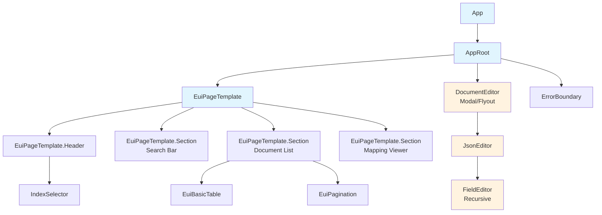
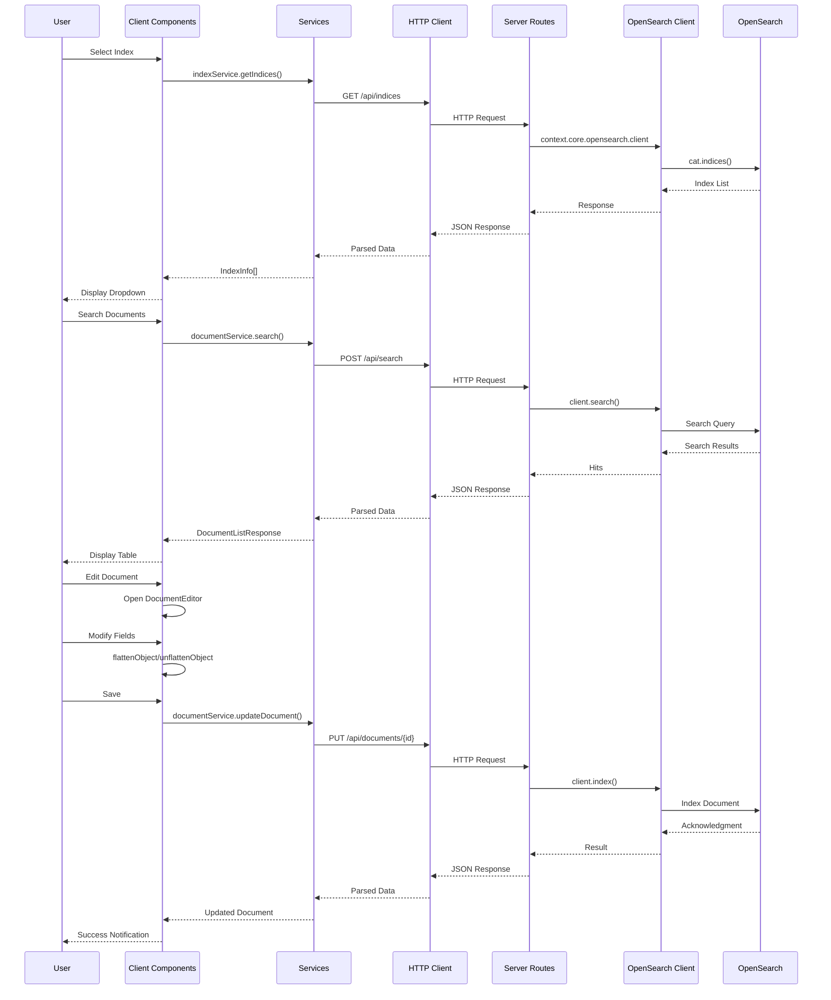

# OpenSearch Index Manager Plugin - Comprehensive Design Document

## Executive Summary

This document provides a complete architectural design for the `opensearch_index_manager` plugin, a production-ready OpenSearch Dashboards (OSD) plugin that provides a CRUD interface for any existing OpenSearch index. The design follows OSD best practices and supports versions 2.19.0 through 2.19.4.

---

## 1. Folder Structure

```
opensearch_index_manager/
├── opensearch_dashboards.json          # Plugin manifest
├── package.json                        # Dependencies and scripts
├── tsconfig.json                       # TypeScript configuration
├── README.md                           # Plugin documentation
├── config.ts                           # Server-side config schema
├── common/
│   ├── constants.ts                    # Shared constants
│   ├── types.ts                        # Shared TypeScript interfaces
│   └── index.ts                        # Common exports
├── public/
│   ├── index.ts                        # Public exports
│   ├── plugin.ts                       # Public plugin lifecycle
│   ├── application.tsx                 # App mount/render logic
│   ├── components/
│   │   ├── app.tsx                     # Root application component
│   │   ├── index_selector/
│   │   │   ├── index_selector.tsx      # Index dropdown component
│   │   │   ├── index_selector.scss     # Styles
│   │   │   └── index.ts
│   │   ├── document_list/
│   │   │   ├── document_list.tsx       # Paginated document table
│   │   │   ├── document_list.scss
│   │   │   └── index.ts
│   │   ├── document_editor/
│   │   │   ├── document_editor.tsx     # Document CRUD editor
│   │   │   ├── json_editor.tsx         # Recursive JSON editor
│   │   │   ├── field_editor.tsx        # Individual field editor
│   │   │   ├── document_editor.scss
│   │   │   └── index.ts
│   │   ├── mapping_viewer/
│   │   │   ├── mapping_viewer.tsx      # Mapping visualization
│   │   │   ├── mapping_viewer.scss
│   │   │   └── index.ts
│   │   ├── search_bar/
│   │   │   ├── search_bar.tsx          # Query DSL search
│   │   │   └── index.ts
│   │   └── common/
│   │       ├── loading_spinner.tsx
│   │       ├── error_boundary.tsx
│   │       └── index.ts
│   ├── services/
│   │   ├── http_service.ts             # HTTP API wrapper
│   │   ├── index_service.ts            # Index operations
│   │   ├── document_service.ts         # Document CRUD operations
│   │   └── index.ts
│   ├── hooks/
│   │   ├── use_indices.ts              # Fetch indices hook
│   │   ├── use_documents.ts            # Fetch documents hook
│   │   ├── use_mapping.ts              # Fetch mapping hook
│   │   └── index.ts
│   └── types/
│       └── index.ts                    # Public type definitions
└── server/
    ├── index.ts                        # Server exports
    ├── plugin.ts                       # Server plugin lifecycle
    ├── types.ts                        # Server type definitions
    ├── routes/
    │   ├── index.ts                    # Route registration
    │   ├── indices_routes.ts           # Index list/mapping routes
    │   ├── document_routes.ts          # Document CRUD routes
    │   └── search_routes.ts            # Search query routes
    ├── services/
    │   ├── opensearch_service.ts       # OSD client wrapper
    │   └── index.ts
    └── lib/
        ├── error_handler.ts            # Error formatting
        ├── schema_validation.ts        # Request validation
        └── index.ts
```

---

## 2. Plugin Manifest (opensearch_dashboards.json)

```json
{
  "id": "opensearch_index_manager",
  "version": "1.0.0",
  "opensearchDashboardsVersion": "2.19.0",
  "server": true,
  "ui": true,
  "requiredPlugins": [
    "navigation",
    "data"
  ],
  "optionalPlugins": [
    "securityDashboards",
    "dataSource"
  ],
  "requiredBundles": [
    "opensearchDashboardsUtils",
    "opensearchDashboardsReact"
  ],
  "configPath": ["opensearch_index_manager"]
}
```

### Plugin Dependencies Rationale

| Dependency | Type | Purpose |
|------------|------|---------|
| `navigation` | required | Register plugin in left navigation menu |
| `data` | required | Access index patterns and search utilities |
| `securityDashboards` | optional | Respect security permissions if installed |
| `dataSource` | optional | Support multi-data-source environments |

---

## 3. Multi-Version Compatibility Strategy

### 3.1 Version Matrix

| OSD Version | Plugin Version | Compatibility Notes |
|-------------|----------------|---------------------|
| 2.19.0 | 1.0.0-osd2.19.0 | Base version |
| 2.19.1 | 1.0.0-osd2.19.1 | API compatible |
| 2.19.2 | 1.0.0-osd2.19.2 | API compatible |
| 2.19.3 | 1.0.0-osd2.19.3 | API compatible |
| 2.19.4 | 1.0.0-osd2.19.4 | API compatible |

### 3.2 Build Configuration Strategy

Create version-specific build configurations using a `versions/` directory:

```
versions/
├── 2.19.0/
│   ├── opensearch_dashboards.json
│   └── package.json
├── 2.19.1/
│   ├── opensearch_dashboards.json
│   └── package.json
├── 2.19.2/
│   ├── opensearch_dashboards.json
│   └── package.json
├── 2.19.3/
│   ├── opensearch_dashboards.json
│   └── package.json
└── 2.19.4/
    ├── opensearch_dashboards.json
    └── package.json
```

### 3.3 Build Scripts (package.json)

```json
{
  "scripts": {
    "build": "yarn plugin-helpers build",
    "build:all": "yarn build:2.19.0 && yarn build:2.19.1 && yarn build:2.19.2 && yarn build:2.19.3 && yarn build:2.19.4",
    "build:2.19.0": "cp versions/2.19.0/opensearch_dashboards.json . && yarn build && mv build build-2.19.0",
    "build:2.19.1": "cp versions/2.19.1/opensearch_dashboards.json . && yarn build && mv build build-2.19.1",
    "build:2.19.2": "cp versions/2.19.2/opensearch_dashboards.json . && yarn build && mv build build-2.19.2",
    "build:2.19.3": "cp versions/2.19.3/opensearch_dashboards.json . && yarn build && mv build build-2.19.3",
    "build:2.19.4": "cp versions/2.19.4/opensearch_dashboards.json . && yarn build && mv build build-2.19.4",
    "plugin-helpers": "node ../../scripts/plugin_helpers"
  }
}
```

### 3.4 Runtime Version Detection

```typescript
// common/version.ts
export const OSD_VERSIONS = ['2.19.0', '2.19.1', '2.19.2', '2.19.3', '2.19.4'] as const;
export type OsdVersion = typeof OSD_VERSIONS[number];

export function parseOsdVersion(version: string): OsdVersion {
  const match = version.match(/^(\d+\.\d+\.\d+)/);
  if (!match) throw new Error(`Invalid OSD version: ${version}`);
  const baseVersion = match[1];
  if (!OSD_VERSIONS.includes(baseVersion as OsdVersion)) {
    throw new Error(`Unsupported OSD version: ${baseVersion}`);
  }
  return baseVersion as OsdVersion;
}
```

---

## 4. Server-Side Architecture

### 4.1 Route Definitions

#### 4.1.1 Index Management Routes

| Method | Path | Description | Validation |
|--------|------|-------------|------------|
| GET | `/api/opensearch_index_manager/indices` | List all indices | Query: `{ pattern?: string }` |
| GET | `/api/opensearch_index_manager/indices/{index}/mapping` | Get index mapping | Params: `{ index: string }` |
| GET | `/api/opensearch_index_manager/indices/{index}/settings` | Get index settings | Params: `{ index: string }` |
| HEAD | `/api/opensearch_index_manager/indices/{index}/exists` | Check index exists | Params: `{ index: string }` |

#### 4.1.2 Document CRUD Routes

| Method | Path | Description | Validation |
|--------|------|-------------|------------|
| GET | `/api/opensearch_index_manager/indices/{index}/documents` | List documents | Params: `{ index: string }`, Query: `{ from?: number, size?: number, sort?: string }` |
| GET | `/api/opensearch_index_manager/indices/{index}/documents/{id}` | Get document by ID | Params: `{ index: string, id: string }` |
| POST | `/api/opensearch_index_manager/indices/{index}/documents` | Create document | Params: `{ index: string }`, Body: `{ document: object, id?: string }` |
| PUT | `/api/opensearch_index_manager/indices/{index}/documents/{id}` | Update document | Params: `{ index: string, id: string }`, Body: `{ document: object }` |
| DELETE | `/api/opensearch_index_manager/indices/{index}/documents/{id}` | Delete document | Params: `{ index: string, id: string }` |

#### 4.1.3 Search Routes

| Method | Path | Description | Validation |
|--------|------|-------------|------------|
| POST | `/api/opensearch_index_manager/indices/{index}/search` | Search with DSL | Params: `{ index: string }`, Body: `{ query: object, from?: number, size?: number, sort?: object[] }` |
| POST | `/api/opensearch_index_manager/indices/{index}/query` | Simple query string | Params: `{ index: string }`, Body: `{ q: string, fields?: string[], from?: number, size?: number }` |

### 4.2 Server Route Implementation Pattern

```typescript
// server/routes/indices_routes.ts
import { IRouter } from 'opensearch-dashboards/server';
import { schema } from '@osd/config-schema';
import { errorHandler } from '../lib/error_handler';

export function registerIndicesRoutes(router: IRouter) {
  // GET /api/opensearch_index_manager/indices
  router.get(
    {
      path: '/api/opensearch_index_manager/indices',
      validate: {
        query: schema.object({
          pattern: schema.maybe(schema.string({ defaultValue: '*' })),
        }),
      },
    },
    async (context, request, response) => {
      try {
        const client = context.core.opensearch.client.asCurrentUser;
        const { pattern = '*' } = request.query;
        
        const result = await client.cat.indices({
          index: pattern,
          format: 'json',
          h: 'index,health,status,docs.count,store.size',
        });
        
        return response.ok({ body: result.body });
      } catch (error) {
        return errorHandler(response, error);
      }
    }
  );

  // GET /api/opensearch_index_manager/indices/{index}/mapping
  router.get(
    {
      path: '/api/opensearch_index_manager/indices/{index}/mapping',
      validate: {
        params: schema.object({
          index: schema.string({
            validate: (value) => {
              if (!/^[a-zA-Z0-9_\-*?]+$/.test(value)) {
                return 'Invalid index name format';
              }
            },
          }),
        }),
      },
    },
    async (context, request, response) => {
      try {
        const client = context.core.opensearch.client.asCurrentUser;
        const { index } = request.params;
        
        const result = await client.indices.getMapping({ index });
        
        return response.ok({ body: result.body });
      } catch (error) {
        return errorHandler(response, error);
      }
    }
  );
}
```

### 4.3 Document Routes Implementation

```typescript
// server/routes/document_routes.ts
import { IRouter } from 'opensearch-dashboards/server';
import { schema } from '@osd/config-schema';
import { errorHandler } from '../lib/error_handler';

// Recursive schema for any JSON value
const jsonValueSchema = schema.oneOf([
  schema.string(),
  schema.number(),
  schema.boolean(),
  schema.null(),
  schema.arrayOf(schema.lazy(() => jsonValueSchema)),
  schema.recordOf(schema.string(), schema.lazy(() => jsonValueSchema)),
]);

export function registerDocumentRoutes(router: IRouter) {
  // GET /api/opensearch_index_manager/indices/{index}/documents
  router.get(
    {
      path: '/api/opensearch_index_manager/indices/{index}/documents',
      validate: {
        params: schema.object({
          index: schema.string(),
        }),
        query: schema.object({
          from: schema.number({ defaultValue: 0, min: 0 }),
          size: schema.number({ defaultValue: 20, min: 1, max: 1000 }),
          sort: schema.maybe(schema.string()),
        }),
      },
    },
    async (context, request, response) => {
      try {
        const client = context.core.opensearch.client.asCurrentUser;
        const { index } = request.params;
        const { from, size, sort } = request.query;
        
        const result = await client.search({
          index,
          body: {
            from,
            size,
            sort: sort ? [sort] : undefined,
            query: { match_all: {} },
          },
        });
        
        return response.ok({
          body: {
            total: result.body.hits.total,
            hits: result.body.hits.hits.map(hit => ({
              _id: hit._id,
              _index: hit._index,
              _score: hit._score,
              _source: hit._source,
            })),
          },
        });
      } catch (error) {
        return errorHandler(response, error);
      }
    }
  );

  // GET /api/opensearch_index_manager/indices/{index}/documents/{id}
  router.get(
    {
      path: '/api/opensearch_index_manager/indices/{index}/documents/{id}',
      validate: {
        params: schema.object({
          index: schema.string(),
          id: schema.string(),
        }),
      },
    },
    async (context, request, response) => {
      try {
        const client = context.core.opensearch.client.asCurrentUser;
        const { index, id } = request.params;
        
        const result = await client.get({ index, id });
        
        return response.ok({
          body: {
            _id: result.body._id,
            _index: result.body._index,
            _version: result.body._version,
            found: result.body.found,
            _source: result.body._source,
          },
        });
      } catch (error) {
        return errorHandler(response, error);
      }
    }
  );

  // POST /api/opensearch_index_manager/indices/{index}/documents
  router.post(
    {
      path: '/api/opensearch_index_manager/indices/{index}/documents',
      validate: {
        params: schema.object({
          index: schema.string(),
        }),
        body: schema.object({
          id: schema.maybe(schema.string()),
          document: schema.recordOf(schema.string(), jsonValueSchema),
        }),
      },
    },
    async (context, request, response) => {
      try {
        const client = context.core.opensearch.client.asCurrentUser;
        const { index } = request.params;
        const { id, document } = request.body;
        
        const result = await client.index({
          index,
          id,
          body: document,
          refresh: 'wait_for',
        });
        
        return response.ok({
          body: {
            _id: result.body._id,
            _index: result.body._index,
            _version: result.body._version,
            result: result.body.result,
          },
        });
      } catch (error) {
        return errorHandler(response, error);
      }
    }
  );

  // PUT /api/opensearch_index_manager/indices/{index}/documents/{id}
  router.put(
    {
      path: '/api/opensearch_index_manager/indices/{index}/documents/{id}',
      validate: {
        params: schema.object({
          index: schema.string(),
          id: schema.string(),
        }),
        body: schema.object({
          document: schema.recordOf(schema.string(), jsonValueSchema),
        }),
      },
    },
    async (context, request, response) => {
      try {
        const client = context.core.opensearch.client.asCurrentUser;
        const { index, id } = request.params;
        const { document } = request.body;
        
        const result = await client.index({
          index,
          id,
          body: document,
          refresh: 'wait_for',
        });
        
        return response.ok({
          body: {
            _id: result.body._id,
            _index: result.body._index,
            _version: result.body._version,
            result: result.body.result,
          },
        });
      } catch (error) {
        return errorHandler(response, error);
      }
    }
  );

  // DELETE /api/opensearch_index_manager/indices/{index}/documents/{id}
  router.delete(
    {
      path: '/api/opensearch_index_manager/indices/{index}/documents/{id}',
      validate: {
        params: schema.object({
          index: schema.string(),
          id: schema.string(),
        }),
      },
    },
    async (context, request, response) => {
      try {
        const client = context.core.opensearch.client.asCurrentUser;
        const { index, id } = request.params;
        
        const result = await client.delete({
          index,
          id,
          refresh: 'wait_for',
        });
        
        return response.ok({
          body: {
            _id: result.body._id,
            _index: result.body._index,
            _version: result.body._version,
            result: result.body.result,
          },
        });
      } catch (error) {
        return errorHandler(response, error);
      }
    }
  );
}
```

### 4.4 Error Handler Utility

```typescript
// server/lib/error_handler.ts
import { OpenSearchDashboardsResponseFactory } from 'opensearch-dashboards/server';

interface OpenSearchError {
  meta?: {
    statusCode?: number;
    body?: {
      error?: {
        type?: string;
        reason?: string;
      };
    };
  };
  message?: string;
}

export function errorHandler(
  response: OpenSearchDashboardsResponseFactory,
  error: OpenSearchError
) {
  const statusCode = error.meta?.statusCode || 500;
  const errorType = error.meta?.body?.error?.type || 'unknown_error';
  const errorReason = error.meta?.body?.error?.reason || error.message || 'An unknown error occurred';

  const errorResponse = {
    statusCode,
    error: errorType,
    message: errorReason,
  };

  switch (statusCode) {
    case 404:
      return response.notFound({ body: errorResponse });
    case 409:
      return response.conflict({ body: errorResponse });
    case 400:
      return response.badRequest({ body: errorResponse });
    case 403:
      return response.forbidden({ body: errorResponse });
    default:
      return response.internalError({ body: errorResponse });
  }
}
```

---

## 5. Client-Side Architecture

### 5.1 Component Hierarchy

```
App (application.tsx)
└── AppRoot (components/app.tsx)
    ├── EuiPageTemplate
    │   ├── EuiPageTemplate.Header
    │   │   └── IndexSelector (components/index_selector/index_selector.tsx)
    │   ├── EuiPageTemplate.Section
    │   │   └── SearchBar (components/search_bar/search_bar.tsx)
    │   ├── EuiPageTemplate.Section
    │   │   └── DocumentList (components/document_list/document_list.tsx)
    │   │       ├── EuiBasicTable (Documents table)
    │   │       └── EuiPagination
    │   └── EuiPageTemplate.Section (optional)
    │       └── MappingViewer (components/mapping_viewer/mapping_viewer.tsx)
    ├── DocumentEditor (components/document_editor/document_editor.tsx) [Modal/Flyout]
    │   └── JsonEditor (components/document_editor/json_editor.tsx)
    │       └── FieldEditor (components/document_editor/field_editor.tsx) [Recursive]
    └── ErrorBoundary (components/common/error_boundary.tsx)
```

### 5.2 Public Plugin Lifecycle

```typescript
// public/plugin.ts
import { CoreSetup, CoreStart, Plugin } from 'opensearch-dashboards/public';
import { PLUGIN_NAME, PLUGIN_ID } from '../common/constants';
import { AppPluginSetupDependencies, AppPluginStartDependencies } from './types';

export class OpenSearchIndexManagerPlugin
  implements Plugin<void, void, AppPluginSetupDependencies, AppPluginStartDependencies>
{
  public setup(core: CoreSetup<AppPluginStartDependencies>) {
    // Register the application
    core.application.register({
      id: PLUGIN_ID,
      title: PLUGIN_NAME,
      order: 4000,
      euiIconType: 'managementApp',
      category: {
        id: 'opensearch',
        label: 'OpenSearch Plugins',
        order: 2000,
      },
      async mount(params: AppMountParameters) {
        // Dynamically import for code splitting
        const { renderApp } = await import('./application');
        const [coreStart, depsStart] = await core.getStartServices();
        return renderApp(coreStart, depsStart, params);
      },
    });

    // Register navigation link
    core.chrome.navGroup.addNavLinksToGroup('management', [
      {
        id: PLUGIN_ID,
        title: PLUGIN_NAME,
        order: 4000,
      },
    ]);
  }

  public start(core: CoreStart) {
    return {};
  }

  public stop() {}
}
```

### 5.3 Application Renderer

```typescript
// public/application.tsx
import React from 'react';
import ReactDOM from 'react-dom';
import { CoreStart, AppMountParameters } from 'opensearch-dashboards/public';
import { AppRoot } from './components/app';
import { AppPluginStartDependencies } from './types';

export const renderApp = (
  core: CoreStart,
  deps: AppPluginStartDependencies,
  { element, history }: AppMountParameters
) => {
  // Set document title
  core.chrome.docTitle.change('Index Manager');
  
  // Render application
  ReactDOM.render(
    <AppRoot core={core} deps={deps} history={history} />,
    element
  );

  return () => {
    ReactDOM.unmountComponentAtNode(element);
  };
};
```

### 5.4 Service Layer

```typescript
// public/services/http_service.ts
import { CoreStart, HttpFetchOptions } from 'opensearch-dashboards/public';

export class HttpService {
  constructor(private http: CoreStart['http']) {}

  async get<T>(path: string, options?: HttpFetchOptions): Promise<T> {
    return this.http.get<T>(path, options);
  }

  async post<T>(path: string, body: any, options?: HttpFetchOptions): Promise<T> {
    return this.http.post<T>(path, { body: JSON.stringify(body), ...options });
  }

  async put<T>(path: string, body: any, options?: HttpFetchOptions): Promise<T> {
    return this.http.put<T>(path, { body: JSON.stringify(body), ...options });
  }

  async delete<T>(path: string, options?: HttpFetchOptions): Promise<T> {
    return this.http.delete<T>(path, options);
  }
}
```

```typescript
// public/services/index_service.ts
import { HttpService } from './http_service';
import { IndexInfo, IndexMapping, ApiResponse } from '../../common/types';

export class IndexService {
  constructor(private http: HttpService) {}

  async getIndices(pattern?: string): Promise<IndexInfo[]> {
    return this.http.get('/api/opensearch_index_manager/indices', {
      query: { pattern },
    });
  }

  async getMapping(index: string): Promise<IndexMapping> {
    return this.http.get(`/api/opensearch_index_manager/indices/${index}/mapping`);
  }

  async getSettings(index: string): Promise<Record<string, any>> {
    return this.http.get(`/api/opensearch_index_manager/indices/${index}/settings`);
  }
}
```

```typescript
// public/services/document_service.ts
import { HttpService } from './http_service';
import { 
  Document, 
  DocumentListResponse, 
  SearchRequest, 
  SearchResponse 
} from '../../common/types';

export class DocumentService {
  constructor(private http: HttpService) {}

  async getDocuments(
    index: string, 
    options: { from?: number; size?: number; sort?: string }
  ): Promise<DocumentListResponse> {
    return this.http.get(`/api/opensearch_index_manager/indices/${index}/documents`, {
      query: options,
    });
  }

  async getDocument(index: string, id: string): Promise<Document> {
    return this.http.get(`/api/opensearch_index_manager/indices/${index}/documents/${id}`);
  }

  async createDocument(index: string, document: Record<string, any>, id?: string): Promise<Document> {
    return this.http.post(`/api/opensearch_index_manager/indices/${index}/documents`, {
      document,
      id,
    });
  }

  async updateDocument(index: string, id: string, document: Record<string, any>): Promise<Document> {
    return this.http.put(`/api/opensearch_index_manager/indices/${index}/documents/${id}`, {
      document,
    });
  }

  async deleteDocument(index: string, id: string): Promise<void> {
    return this.http.delete(`/api/opensearch_index_manager/indices/${index}/documents/${id}`);
  }

  async search(index: string, request: SearchRequest): Promise<SearchResponse> {
    return this.http.post(`/api/opensearch_index_manager/indices/${index}/search`, request);
  }
}
```

---

## 6. Nested Field Support Design

### 6.1 Data Model for Nested Fields

```typescript
// common/types.ts

// Represents a field value that can be any JSON type
export type JsonValue = 
  | string 
  | number 
  | boolean 
  | null 
  | JsonValue[] 
  | { [key: string]: JsonValue };

// Field type classification
export enum FieldType {
  STRING = 'string',
  NUMBER = 'number',
  BOOLEAN = 'boolean',
  NULL = 'null',
  ARRAY = 'array',
  OBJECT = 'object',
  DATE = 'date',
  GEO_POINT = 'geo_point',
  IP = 'ip',
}

// Flattened field entry for form handling
export interface FlattenedField {
  path: string;           // Dot-notation path (e.g., "user.address.city")
  key: string;            // Local key (e.g., "city")
  value: JsonValue;       // The actual value
  type: FieldType;        // Inferred or mapped type
  depth: number;          // Nesting depth (0 = root)
  parentPath?: string;    // Parent path for navigation
  isArrayItem?: boolean;  // Is this an array element
  arrayIndex?: number;    // Index if array item
}

// Mapping field property
export interface MappingProperty {
  type?: string;
  properties?: Record<string, MappingProperty>;
  fields?: Record<string, MappingProperty>;
}

export interface IndexMapping {
  [indexName: string]: {
    mappings: {
      properties: Record<string, MappingProperty>;
    };
  };
}
```

### 6.2 Flattening/Unflattening Utilities

```typescript
// common/field_utils.ts

import { JsonValue, FlattenedField, FieldType } from './types';

/**
 * Get the type of a JSON value
 */
export function getValueType(value: JsonValue): FieldType {
  if (value === null) return FieldType.NULL;
  if (Array.isArray(value)) return FieldType.ARRAY;
  const typeofValue = typeof value;
  switch (typeofValue) {
    case 'string': return FieldType.STRING;
    case 'number': return FieldType.NUMBER;
    case 'boolean': return FieldType.BOOLEAN;
    case 'object': return FieldType.OBJECT;
    default: return FieldType.STRING;
  }
}

/**
 * Flatten a nested object into an array of fields
 */
export function flattenObject(
  obj: Record<string, JsonValue>,
  parentPath = '',
  depth = 0
): FlattenedField[] {
  const fields: FlattenedField[] = [];

  for (const [key, value] of Object.entries(obj)) {
    const currentPath = parentPath ? `${parentPath}.${key}` : key;
    const type = getValueType(value);

    const field: FlattenedField = {
      path: currentPath,
      key,
      value,
      type,
      depth,
      parentPath: parentPath || undefined,
    };

    fields.push(field);

    // Recursively flatten objects and arrays
    if (type === FieldType.OBJECT && value !== null) {
      fields.push(...flattenObject(value as Record<string, JsonValue>, currentPath, depth + 1));
    } else if (type === FieldType.ARRAY) {
      (value as JsonValue[]).forEach((item, index) => {
        const arrayPath = `${currentPath}[${index}]`;
        const itemType = getValueType(item);
        
        fields.push({
          path: arrayPath,
          key: `[${index}]`,
          value: item,
          type: itemType,
          depth: depth + 1,
          parentPath: currentPath,
          isArrayItem: true,
          arrayIndex: index,
        });

        if (itemType === FieldType.OBJECT && item !== null) {
          fields.push(...flattenObject(item as Record<string, JsonValue>, arrayPath, depth + 2));
        }
      });
    }
  }

  return fields;
}

/**
 * Unflatten fields back into a nested object
 */
export function unflattenObject(fields: FlattenedField[]): Record<string, JsonValue> {
  const result: Record<string, JsonValue> = {};

  // Sort by depth to build from leaves up
  const sortedFields = [...fields].sort((a, b) => a.depth - b.depth);

  for (const field of sortedFields) {
    if (field.parentPath) {
      // This is a nested field
      setNestedValue(result, field.path, field.value);
    } else {
      // Root level field
      result[field.key] = field.value;
    }
  }

  return result;
}

/**
 * Set a value at a nested path
 */
function setNestedValue(obj: Record<string, JsonValue>, path: string, value: JsonValue): void {
  const parts = path.split('.');
  let current: any = obj;

  for (let i = 0; i < parts.length - 1; i++) {
    const part = parts[i];
    
    // Handle array notation like "items[0]"
    const arrayMatch = part.match(/^(.+)\[(\d+)\]$/);
    
    if (arrayMatch) {
      const [_, arrayKey, indexStr] = arrayMatch;
      const index = parseInt(indexStr, 10);
      
      if (!current[arrayKey]) {
        current[arrayKey] = [];
      }
      
      if (!current[arrayKey][index]) {
        current[arrayKey][index] = {};
      }
      
      current = current[arrayKey][index];
    } else {
      if (!current[part]) {
        current[part] = {};
      }
      current = current[part];
    }
  }

  const lastPart = parts[parts.length - 1];
  const arrayMatch = lastPart.match(/^(.+)\[(\d+)\]$/);
  
  if (arrayMatch) {
    const [_, arrayKey, indexStr] = arrayMatch;
    const index = parseInt(indexStr, 10);
    
    if (!current[arrayKey]) {
      current[arrayKey] = [];
    }
    
    current[arrayKey][index] = value;
  } else {
    current[lastPart] = value;
  }
}
```

### 6.3 Recursive Field Editor Component Design

```typescript
// public/components/document_editor/field_editor.tsx

import React from 'react';
import {
  EuiFieldText,
  EuiFieldNumber,
  EuiSwitch,
  EuiButtonIcon,
  EuiFlexGroup,
  EuiFlexItem,
  EuiText,
} from '@elastic/eui';
import { JsonValue, FlattenedField, FieldType } from '../../../common/types';

interface FieldEditorProps {
  field: FlattenedField;
  onChange: (path: string, value: JsonValue) => void;
  onDelete: (path: string) => void;
  onAddField?: (parentPath: string) => void;
}

export const FieldEditor: React.FC<FieldEditorProps> = ({
  field,
  onChange,
  onDelete,
  onAddField,
}) => {
  const handleValueChange = (newValue: JsonValue) => {
    onChange(field.path, newValue);
  };

  const renderValueInput = () => {
    switch (field.type) {
      case FieldType.STRING:
        return (
          <EuiFieldText
            value={String(field.value || '')}
            onChange={(e) => handleValueChange(e.target.value)}
            fullWidth
          />
        );

      case FieldType.NUMBER:
        return (
          <EuiFieldNumber
            value={Number(field.value || 0)}
            onChange={(e) => handleValueChange(Number(e.target.value))}
            fullWidth
          />
        );

      case FieldType.BOOLEAN:
        return (
          <EuiSwitch
            label={String(field.value)}
            checked={Boolean(field.value)}
            onChange={(e) => handleValueChange(e.target.checked)}
          />
        );

      case FieldType.NULL:
        return <EuiText color="subdued">null</EuiText>;

      case FieldType.OBJECT:
        return (
          <EuiButtonIcon
            iconType="plus"
            aria-label="Add nested field"
            onClick={() => onAddField?.(field.path)}
          />
        );

      case FieldType.ARRAY:
        return (
          <EuiText color="subdued">
            Array ({Array.isArray(field.value) ? field.value.length : 0} items)
          </EuiText>
        );

      default:
        return (
          <EuiFieldText
            value={String(field.value || '')}
            onChange={(e) => handleValueChange(e.target.value)}
            fullWidth
          />
        );
    }
  };

  const indentation = field.depth * 24;

  return (
    <EuiFlexGroup
      gutterSize="s"
      alignItems="center"
      style={{ marginLeft: `${indentation}px`, marginBottom: '8px' }}
    >
      <EuiFlexItem grow={false} style={{ minWidth: '150px' }}>
        <EuiText size="s">
          <code>{field.key}</code>
          <span style={{ marginLeft: '8px', color: '#666' }}>
            ({field.type})
          </span>
        </EuiText>
      </EuiFlexItem>

      <EuiFlexItem>{renderValueInput()}</EuiFlexItem>

      <EuiFlexItem grow={false}>
        <EuiButtonIcon
          iconType="trash"
          color="danger"
          aria-label="Delete field"
          onClick={() => onDelete(field.path)}
        />
      </EuiFlexItem>
    </EuiFlexGroup>
  );
};
```

### 6.4 JSON Editor Component

```typescript
// public/components/document_editor/json_editor.tsx

import React, { useState, useMemo, useCallback } from 'react';
import {
  EuiPanel,
  EuiSpacer,
  EuiButton,
  EuiFlexGroup,
  EuiFlexItem,
  EuiCodeBlock,
} from '@elastic/eui';
import { FieldEditor } from './field_editor';
import { flattenObject, unflattenObject } from '../../../common/field_utils';
import { JsonValue, FlattenedField } from '../../../common/types';

interface JsonEditorProps {
  value: Record<string, JsonValue>;
  onChange: (value: Record<string, JsonValue>) => void;
  readOnly?: boolean;
}

export const JsonEditor: React.FC<JsonEditorProps> = ({
  value,
  onChange,
  readOnly = false,
}) => {
  const [showRaw, setShowRaw] = useState(false);
  const [newFieldParent, setNewFieldParent] = useState<string | null>(null);

  // Flatten the document for editing
  const flattenedFields = useMemo(() => {
    return flattenObject(value);
  }, [value]);

  // Group fields by parent for hierarchical display
  const fieldTree = useMemo(() => {
    const tree: Record<string, FlattenedField[]> = {};
    
    flattenedFields.forEach((field) => {
      const parentKey = field.parentPath || '__root__';
      if (!tree[parentKey]) {
        tree[parentKey] = [];
      }
      tree[parentKey].push(field);
    });
    
    return tree;
  }, [flattenedFields]);

  const handleFieldChange = useCallback(
    (path: string, newValue: JsonValue) => {
      const updatedFields = flattenedFields.map((f) =>
        f.path === path ? { ...f, value: newValue } : f
      );
      const newDocument = unflattenObject(updatedFields);
      onChange(newDocument);
    },
    [flattenedFields, onChange]
  );

  const handleFieldDelete = useCallback(
    (path: string) => {
      const updatedFields = flattenedFields.filter((f) => f.path !== path);
      const newDocument = unflattenObject(updatedFields);
      onChange(newDocument);
    },
    [flattenedFields, onChange]
  );

  const handleAddField = useCallback(
    (parentPath: string) => {
      setNewFieldParent(parentPath);
      // Implementation would show a modal to add new field
    },
    []
  );

  const renderFields = (parentKey: string = '__root__'): React.ReactNode => {
    const fields = fieldTree[parentKey] || [];
    
    return fields.map((field) => (
      <div key={field.path}>
        <FieldEditor
          field={field}
          onChange={handleFieldChange}
          onDelete={handleFieldDelete}
          onAddField={readOnly ? undefined : handleAddField}
        />
        {/* Recursively render nested fields if this is an object */}
        {field.type === 'object' && fieldTree[field.path] && (
          <div style={{ marginLeft: '24px' }}>
            {renderFields(field.path)}
          </div>
        )}
      </div>
    ));
  };

  return (
    <EuiPanel>
      <EuiFlexGroup justifyContent="flexEnd">
        <EuiFlexItem grow={false}>
          <EuiButton
            size="s"
            onClick={() => setShowRaw(!showRaw)}
          >
            {showRaw ? 'Show Fields' : 'Show Raw JSON'}
          </EuiButton>
        </EuiFlexItem>
      </EuiFlexGroup>

      <EuiSpacer size="m" />

      {showRaw ? (
        <EuiCodeBlock language="json" isCopyable>
          {JSON.stringify(value, null, 2)}
        </EuiCodeBlock>
      ) : (
        <div>{renderFields()}</div>
      )}
    </EuiPanel>
  );
};
```

---

## 7. TypeScript Interface Definitions

### 7.1 Common Types (common/types.ts)

```typescript
// common/types.ts

// ============================================================
// Plugin Constants
// ============================================================

export const PLUGIN_ID = 'opensearch_index_manager';
export const PLUGIN_NAME = 'Index Manager';

// ============================================================
// API Response Types
// ============================================================

export interface ApiResponse<T> {
  data: T;
  status: number;
}

export interface ApiError {
  statusCode: number;
  error: string;
  message: string;
}

// ============================================================
// Index Types
// ============================================================

export interface IndexInfo {
  index: string;
  health: 'green' | 'yellow' | 'red';
  status: 'open' | 'close';
  'docs.count': string;
  'store.size': string;
  [key: string]: string;
}

export interface IndexStats {
  index: string;
  primaries: {
    docs: {
      count: number;
      deleted: number;
    };
    store: {
      size_in_bytes: number;
    };
  };
}

export interface IndexSettings {
  [key: string]: any;
}

// ============================================================
// Mapping Types
// ============================================================

export interface MappingProperty {
  type?: string;
  analyzer?: string;
  format?: string;
  properties?: Record<string, MappingProperty>;
  fields?: Record<string, MappingProperty>;
  ignore_above?: number;
  coerce?: boolean;
  doc_values?: boolean;
  index?: boolean;
  null_value?: any;
}

export interface IndexMapping {
  [indexName: string]: {
    mappings: {
      dynamic?: boolean | 'strict';
      _source?: {
        enabled?: boolean;
      };
      properties: Record<string, MappingProperty>;
    };
  };
}

// ============================================================
// Document Types
// ============================================================

export type JsonValue = 
  | string 
  | number 
  | boolean 
  | null 
  | JsonValue[] 
  | { [key: string]: JsonValue };

export interface Document {
  _id: string;
  _index: string;
  _version?: number;
  _score?: number;
  found?: boolean;
  _source: Record<string, JsonValue>;
}

export interface DocumentListResponse {
  total: number | { value: number; relation: string };
  hits: Document[];
}

export interface DocumentCreateRequest {
  id?: string;
  document: Record<string, JsonValue>;
}

export interface DocumentUpdateRequest {
  document: Record<string, JsonValue>;
}

export interface DocumentDeleteResponse {
  _id: string;
  _index: string;
  _version: number;
  result: string;
}

// ============================================================
// Search Types
// ============================================================

export interface SearchRequest {
  query: Record<string, any>;
  from?: number;
  size?: number;
  sort?: Array<Record<string, 'asc' | 'desc' | object>>;
  _source?: string[] | boolean;
  aggs?: Record<string, any>;
}

export interface SearchResponse {
  took: number;
  timed_out: boolean;
  hits: {
    total: number | { value: number; relation: string };
    max_score: number | null;
    hits: Document[];
  };
  aggregations?: Record<string, any>;
}

export interface SimpleQueryRequest {
  q: string;
  fields?: string[];
  from?: number;
  size?: number;
}

// ============================================================
// Field Types
// ============================================================

export enum FieldType {
  STRING = 'string',
  NUMBER = 'number',
  BOOLEAN = 'boolean',
  NULL = 'null',
  ARRAY = 'array',
  OBJECT = 'object',
  DATE = 'date',
  GEO_POINT = 'geo_point',
  IP = 'ip',
  KEYWORD = 'keyword',
  TEXT = 'text',
  INTEGER = 'integer',
  LONG = 'long',
  FLOAT = 'float',
  DOUBLE = 'double',
  NESTED = 'nested',
}

export interface FlattenedField {
  path: string;
  key: string;
  value: JsonValue;
  type: FieldType | string;
  depth: number;
  parentPath?: string;
  isArrayItem?: boolean;
  arrayIndex?: number;
  mappingType?: string; // From index mapping
}

// ============================================================
// Plugin Configuration
// ============================================================

export interface PluginConfig {
  enabled: boolean;
  maxDocumentsPerPage: number;
  defaultDocumentsPerPage: number;
  maxNestedDepth: number;
  enableRawJsonEdit: boolean;
  enableDeleteConfirmation: boolean;
}

// ============================================================
// UI State Types
// ============================================================

export interface AppState {
  selectedIndex: string | null;
  currentPage: number;
  pageSize: number;
  sortField: string | null;
  sortDirection: 'asc' | 'desc';
  searchQuery: Record<string, any> | null;
  selectedDocument: Document | null;
  isEditing: boolean;
  isCreating: boolean;
}
```

### 7.2 Server Types (server/types.ts)

```typescript
// server/types.ts

import { IRouter, IScopedClusterClient } from 'opensearch-dashboards/server';

// Server-side plugin context
export interface ServerPluginContext {
  router: IRouter;
}

// Request handler context extension
export interface RequestHandlerContext {
  core: {
    opensearch: {
      client: IScopedClusterClient;
    };
  };
}

// Route handler return types
export type IndexListResponse = Array<{
  index: string;
  health: string;
  status: string;
  'docs.count': string;
  'store.size': string;
}>;
```

### 7.3 Public Types (public/types.ts)

```typescript
// public/types.ts

import { NavigationPublicPluginStart } from '../../../src/plugins/navigation/public';
import { DataPublicPluginStart } from '../../../src/plugins/data/public';

// Plugin setup dependencies (from requiredPlugins)
export interface AppPluginSetupDependencies {
  // No setup dependencies needed
}

// Plugin start dependencies (from requiredPlugins)
export interface AppPluginStartDependencies {
  navigation: NavigationPublicPluginStart;
  data: DataPublicPluginStart;
}

// Services exposed by this plugin (if any)
export interface AppPluginStart {
  // This plugin doesn't expose external services
}
```

---

## 8. Configuration Schema

### 8.1 Server Config (config.ts)

```typescript
// config.ts

import { schema, TypeOf } from '@osd/config-schema';

export const configSchema = schema.object({
  enabled: schema.boolean({ defaultValue: true }),
  maxDocumentsPerPage: schema.number({ defaultValue: 1000, min: 1, max: 10000 }),
  defaultDocumentsPerPage: schema.number({ defaultValue: 20, min: 1, max: 100 }),
  maxNestedDepth: schema.number({ defaultValue: 10, min: 1, max: 50 }),
  enableRawJsonEdit: schema.boolean({ defaultValue: true }),
  enableDeleteConfirmation: schema.boolean({ defaultValue: true }),
});

export type ConfigType = TypeOf<typeof configSchema>;
```

### 8.2 OpenSearch Dashboards Config (opensearch_dashboards.yml)

```yaml
# opensearch_dashboards.yml configuration options

opensearch_index_manager:
  enabled: true
  maxDocumentsPerPage: 1000
  defaultDocumentsPerPage: 20
  maxNestedDepth: 10
  enableRawJsonEdit: true
  enableDeleteConfirmation: true
```

---

## 9. Build Configuration

### 9.1 TypeScript Configuration (tsconfig.json)

```json
{
  "extends": "../../tsconfig.json",
  "compilerOptions": {
    "outDir": "./target",
    "skipLibCheck": true,
    "esModuleInterop": true,
    "moduleResolution": "node",
    "resolveJsonModule": true,
    "strict": true,
    "noImplicitAny": true,
    "strictNullChecks": true,
    "strictFunctionTypes": true,
    "strictBindCallApply": true,
    "strictPropertyInitialization": true,
    "noImplicitThis": true,
    "alwaysStrict": true,
    "noUnusedLocals": true,
    "noUnusedParameters": true,
    "noImplicitReturns": true,
    "noFallthroughCasesInSwitch": true,
    "baseUrl": ".",
    "paths": {
      "opensearch-dashboards/*": ["../../src/core/*"],
      "plugins/*": ["../../src/plugins/*"]
    }
  },
  "include": [
    "common/**/*",
    "public/**/*",
    "server/**/*",
    "config.ts"
  ],
  "exclude": [
    "node_modules",
    "target",
    "build"
  ]
}
```

### 9.2 Package.json

```json
{
  "name": "opensearch_index_manager",
  "version": "1.0.0",
  "description": "CRUD interface for OpenSearch indices",
  "main": "index.js",
  "opensearchDashboards": {
    "version": "2.19.0",
    "templateVersion": "1.0.0"
  },
  "scripts": {
    "build": "yarn plugin-helpers build",
    "build:all": "yarn build:2.19.0 && yarn build:2.19.1 && yarn build:2.19.2 && yarn build:2.19.3 && yarn build:2.19.4",
    "build:2.19.0": "cp versions/2.19.0/opensearch_dashboards.json . && yarn build && mv build build-2.19.0",
    "build:2.19.1": "cp versions/2.19.1/opensearch_dashboards.json . && yarn build && mv build build-2.19.1",
    "build:2.19.2": "cp versions/2.19.2/opensearch_dashboards.json . && yarn build && mv build build-2.19.2",
    "build:2.19.3": "cp versions/2.19.3/opensearch_dashboards.json . && yarn build && mv build build-2.19.3",
    "build:2.19.4": "cp versions/2.19.4/opensearch_dashboards.json . && yarn build && mv build build-2.19.4",
    "plugin-helpers": "node ../../scripts/plugin_helpers",
    "osd": "node ../../scripts/osd",
    "lint": "eslint .",
    "test": "jest"
  },
  "devDependencies": {
    "@osd/plugin-helpers": "link:../../packages/osd-plugin-helpers",
    "typescript": "^4.5.0"
  },
  "dependencies": {}
}
```

### 9.3 Version-Specific Manifest (versions/2.19.0/opensearch_dashboards.json)

```json
{
  "id": "opensearch_index_manager",
  "version": "1.0.0",
  "opensearchDashboardsVersion": "2.19.0",
  "server": true,
  "ui": true,
  "requiredPlugins": [
    "navigation",
    "data"
  ],
  "optionalPlugins": [
    "securityDashboards",
    "dataSource"
  ],
  "requiredBundles": [
    "opensearchDashboardsUtils",
    "opensearchDashboardsReact"
  ],
  "configPath": ["opensearch_index_manager"]
}
```

### 9.4 Version-Specific Manifest (versions/2.19.4/opensearch_dashboards.json)

```json
{
  "id": "opensearch_index_manager",
  "version": "1.0.0",
  "opensearchDashboardsVersion": "2.19.4",
  "server": true,
  "ui": true,
  "requiredPlugins": [
    "navigation",
    "data"
  ],
  "optionalPlugins": [
    "securityDashboards",
    "dataSource"
  ],
  "requiredBundles": [
    "opensearchDashboardsUtils",
    "opensearchDashboardsReact"
  ],
  "configPath": ["opensearch_index_manager"]
}
```

---

## 10. Component Hierarchy Diagram (Mermaid)



---

## 11. Data Flow Diagram (Mermaid)



---

## 12. Security Considerations

### 12.1 Index Name Validation
- Use regex pattern: `^[a-zA-Z0-9_\-*?]+$`
- Reject paths containing `..` or null bytes
- Validate index exists before operations

### 12.2 Request Size Limits
- Max document size: 100MB (configurable)
- Max nested depth: 10 levels (configurable)
- Max array size: 10000 items

### 12.3 Permission Integration
- Check if `securityDashboards` plugin is available
- Use OSD's built-in authorization for API access
- Respect index-level security settings

---

## 13. Error Handling Strategy

### 13.1 Server-Side Error Categories

| HTTP Code | OSD Error Type | OpenSearch Error | User Message |
|-----------|----------------|------------------|--------------|
| 400 | badRequest | parse_exception | Invalid query syntax |
| 404 | notFound | index_not_found | Index does not exist |
| 409 | conflict | version_conflict | Document was modified |
| 403 | forbidden | security_exception | Insufficient permissions |
| 500 | internalError | * | Unexpected server error |

### 13.2 Client-Side Error Handling
- Use ErrorBoundary for React component errors
- Display toast notifications for API errors
- Form validation before submission
- Confirm dialogs for destructive actions

---

## 14. Implementation Priority

### Phase 1: Core Infrastructure
1. Plugin manifest and lifecycle setup
2. Server route scaffolding
3. Type definitions
4. Basic client app structure

### Phase 2: Index Operations
1. Index listing endpoint
2. Index selector component
3. Mapping viewer

### Phase 3: Document CRUD
1. Document list with pagination
2. Document retrieval
3. Document creation
4. Document update
5. Document deletion

### Phase 4: Advanced Features
1. Nested field editor
2. Search functionality
3. Bulk operations
4. Export/Import

### Phase 5: Polish
1. Error handling
2. Loading states
3. Empty states
4. Confirmation dialogs

---

## 15. Summary

This design provides a complete, production-ready architecture for an OpenSearch Dashboards plugin that:

- Follows OSD plugin development best practices
- Supports multiple OSD versions (2.19.0 - 2.19.4)
- Provides comprehensive CRUD operations
- Handles arbitrarily nested JSON structures
- Includes proper error handling and validation
- Uses TypeScript for type safety throughout
- Separates concerns between server and client
- Leverages OSD's core services and UI components

The architecture is modular, extensible, and ready for implementation in Code mode.
