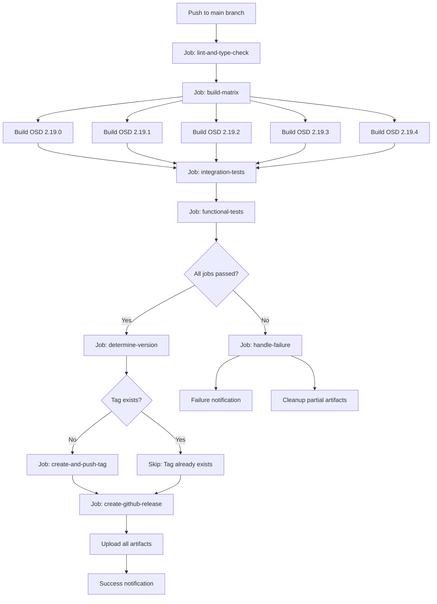
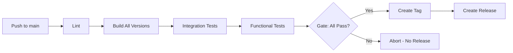
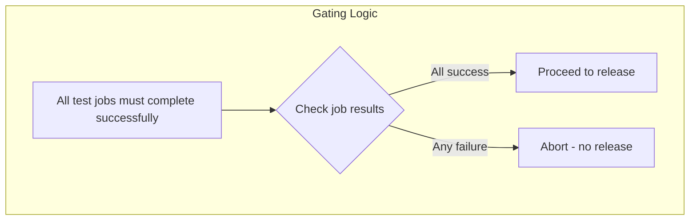

# Revised CI/CD Workflow Design

## Document Purpose

This document describes a revised CI/CD workflow design that gates all GitHub publishing operations behind successful test completion. The current workflow has a fundamental flaw where the git tag is created BEFORE tests run, meaning failed tests still leave a tag on GitHub.

---

## Problem Statement

### Current Workflow Flaw

The existing [`.github/workflows/ci-cd.yml`](../.github/workflows/ci-cd.yml) triggers on git tags and creates releases after tests pass, but the tag already exists:

```yaml
on:
  push:
    tags:
      - 'v*'      # Tag already exists when workflow starts
```

**Impact:** If any test fails after the tag push, the tag remains on GitHub, creating:
- Orphaned tags without corresponding releases
- Confusion about release status
- Manual cleanup required
- Potential for partial/incomplete releases

---

## Proposed Solution: Test-Gated Publishing

### Core Principle

**Tag creation and release publishing must ONLY occur after ALL tests pass successfully.**

### Workflow Philosophy

```
┌─────────────────────────────────────────────────────────────────────────────┐
│                        REVISED CI/CD PHILOSOPHY                             │
├─────────────────────────────────────────────────────────────────────────────┤
│                                                                             │
│  ┌──────────────┐                                                           │
│  │ Push to main │                                                           │
│  └──────┬───────┘                                                           │
│         │                                                                   │
│         ▼                                                                   │
│  ┌───────────────────────────────────────────────────────────────────────┐ │
│  │                     COMPREHENSIVE TEST STAGE                          │ │
│  │  ┌─────────┐  ┌──────────────┐  ┌──────────────┐  ┌──────────────┐   │ │
│  │  │  Lint   │──│Build Matrix  │──│ Integration  │──│  Functional  │   │ │
│  │  │ Checks  │  │(5 OSD vers)  │  │    Tests     │  │    Tests     │   │ │
│  │  └─────────┘  └──────────────┘  └──────────────┘  └──────────────┘   │ │
│  └───────────────────────────────────────────────────────────────────────┘ │
│         │                                                                   │
│         ▼                                                                   │
│    ┌─────────┬─────────┐                                                    │
│    │         │         │                                                    │
│    ▼         ▼         ▼                                                    │
│ ┌──────┐  ┌──────┐  ┌──────┐                                                │
│ │PASS ✅│  │FAIL ❌│  │ABORT │                                                │
│ └──┬───┘  └──┬───┘  └──────┘                                                │
│    │         │                                                               │
│    ▼         ▼                                                               │
│ ┌─────────┐ ┌─────────────────┐                                              │
│ │Create   │ │No tag created   │                                              │
│ │Tag vX.X │ │No release made  │                                              │
│ │Create   │ │Clear failure    │                                              │
│ │Release  │ │notification     │                                              │
│ └─────────┘ └─────────────────┘                                              │
│                                                                             │
└─────────────────────────────────────────────────────────────────────────────┘
```

---

## Revised Job Dependency Graph

### Mermaid Diagram: Complete Workflow



### Simplified Linear Flow



---

## Detailed Job Specifications

### Job 1: Trigger & Environment Setup

**Trigger Configuration:**
```yaml
on:
  push:
    branches:
      - main
    paths-ignore:
      - '**/*.md'
      - 'docs/**'
      - '.gitignore'
  workflow_dispatch:
    inputs:
      force_release:
        description: 'Force release even if tag exists'
        type: boolean
        default: false
```

**Key Changes:**
- Remove `tags` trigger - tags are now CREATED by the workflow, not triggering it
- Add `paths-ignore` to avoid running on documentation-only changes
- Add `workflow_dispatch` for manual releases with safety controls

---

### Job 2: Lint and Type Check

**Purpose:** Fast feedback on code quality issues

```yaml
lint-and-type-check:
  name: Lint and Type Check
  runs-on: ubuntu-latest
  timeout-minutes: 15

  steps:
    - name: Checkout Code
      uses: actions/checkout@v4

    - name: Setup Node.js
      uses: actions/setup-node@v4
      with:
        node-version: ${{ env.NODE_VERSION }}
        cache: 'yarn'
        cache-dependency-path: ${{ env.PLUGIN_NAME }}/yarn.lock

    - name: Install Dependencies
      working-directory: ./${{ env.PLUGIN_NAME }}
      run: yarn install --frozen-lockfile

    - name: Run ESLint
      working-directory: ./${{ env.PLUGIN_NAME }}
      run: yarn lint

    - name: Run Prettier Check
      working-directory: ./${{ env.PLUGIN_NAME }}
      run: yarn prettier --check "**/*.{ts,tsx,js,json,md}"
```

**Failure Behavior:** Pipeline aborts immediately - no further jobs run

---

### Job 3: Build Matrix (All OSD Versions)

**Purpose:** Build plugin artifacts for all supported OSD versions in parallel

```yaml
build:
  name: Build OSD ${{ matrix.osd_version }}
  runs-on: ubuntu-latest
  needs: lint-and-type-check
  timeout-minutes: 45

  strategy:
    fail-fast: true  # Stop all builds if any version fails
    matrix:
      osd_version: ["2.19.0", "2.19.1", "2.19.2", "2.19.3", "2.19.4"]

  outputs:
    plugin_version: ${{ steps.version.outputs.version }}
    build_success: ${{ steps.build.outputs.success }}

  steps:
    # ... build steps ...
    - name: Upload Build Artifact
      uses: actions/upload-artifact@v4
      with:
        name: ${{ env.PLUGIN_NAME }}-${{ steps.version.outputs.version }}-osd-${{ matrix.osd_version }}
        path: osd-source/plugins/${{ env.PLUGIN_NAME }}/build/*.zip
        retention-days: 1  # Short retention - will be in release artifacts
```

**Key Changes:**
- `fail-fast: true` - If any OSD version fails to build, cancel all others
- Short artifact retention (1 day) since artifacts will be in releases
- Capture version output for downstream jobs

---

### Job 4: Integration Tests

**Purpose:** Containerized tests with Podman + OpenSearch

```yaml
integration-tests:
  name: Integration Tests
  runs-on: ubuntu-latest
  needs: build
  timeout-minutes: 30

  steps:
    - name: Checkout Code
      uses: actions/checkout@v4

    - name: Install Podman
      run: |
        sudo apt-get update
        sudo apt-get install -y podman podman-compose

    - name: Download Build Artifact
      uses: actions/download-artifact@v4
      with:
        name: ${{ env.PLUGIN_NAME }}-${{ needs.build.outputs.plugin_version }}-osd-2.19.0
        path: ./build

    - name: Start OpenSearch & OSD
      run: |
        export OPENSEARCH_VERSION=${{ env.OPENSEARCH_VERSION }}
        export OSD_VERSION=2.19.0
        export PLUGIN_PATH=$(pwd)/build/${{ env.PLUGIN_NAME }}-*.zip
        podman-compose -f podman-compose.yml up -d
        
        # Health checks
        timeout 180 bash -c 'until curl -s http://localhost:9200 >/dev/null; do sleep 5; done'
        timeout 180 bash -c 'until curl -s http://localhost:5601/api/status | grep -q "green\|yellow"; do sleep 5; done'

    - name: Install Plugin
      run: |
        # Install plugin in running OSD container
        PLUGIN_ZIP=$(ls build/${{ env.PLUGIN_NAME }}-*.zip | head -1)
        podman cp "$PLUGIN_ZIP" osim-dashboards:/tmp/
        podman exec osim-dashboards ./bin/opensearch-dashboards-plugin install file:///tmp/$(basename "$PLUGIN_ZIP")
        podman restart osim-dashboards
        
        # Verify plugin loaded
        timeout 180 bash -c 'until curl -s http://localhost:5601/api/status | grep -q "green\|yellow"; do sleep 5; done'

    - name: Run API Tests
      run: |
        # Test plugin endpoints
        curl -sf http://localhost:5601/api/${{ env.PLUGIN_NAME }}/health || exit 1
        curl -sf http://localhost:5601/api/${{ env.PLUGIN_NAME }}/indices || exit 1

    - name: Cleanup
      if: always()
      run: |
        podman-compose -f podman-compose.yml down -v || true
        podman system prune -f || true
```

**Failure Behavior:** Pipeline aborts - no functional tests or release

---

### Job 5: Functional Tests (Playwright)

**Purpose:** End-to-end tests with plugin registration verification

```yaml
functional-tests:
  name: Functional Tests (Playwright)
  runs-on: ubuntu-latest
  needs: [build, integration-tests]
  timeout-minutes: 45

  steps:
    - name: Checkout Code
      uses: actions/checkout@v4

    - name: Setup Node.js
      uses: actions/setup-node@v4
      with:
        node-version: ${{ env.NODE_VERSION }}

    - name: Install Podman
      run: |
        sudo apt-get update
        sudo apt-get install -y podman podman-compose

    - name: Download Build Artifact
      uses: actions/download-artifact@v4
      with:
        name: ${{ env.PLUGIN_NAME }}-${{ needs.build.outputs.plugin_version }}-osd-2.19.0
        path: ./build

    - name: Start Test Environment
      run: |
        export OPENSEARCH_VERSION=${{ env.OPENSEARCH_VERSION }}
        export OSD_VERSION=2.19.0
        export PLUGIN_PATH=$(pwd)/build/${{ env.PLUGIN_NAME }}-*.zip
        podman-compose -f podman-compose.yml up -d
        
        # Wait for services
        timeout 180 bash -c 'until curl -s http://localhost:9200 >/dev/null; do sleep 5; done'
        timeout 180 bash -c 'until curl -s http://localhost:5601/api/status | grep -q "green\|yellow"; do sleep 5; done'

    - name: Install Plugin
      run: |
        PLUGIN_ZIP=$(ls build/${{ env.PLUGIN_NAME }}-*.zip | head -1)
        podman cp "$PLUGIN_ZIP" osim-dashboards:/tmp/
        podman exec osim-dashboards ./bin/opensearch-dashboards-plugin install file:///tmp/$(basename "$PLUGIN_ZIP")
        podman restart osim-dashboards
        timeout 180 bash -c 'until curl -s http://localhost:5601/api/status | grep -q "green\|yellow"; do sleep 5; done'

    - name: Install Test Dependencies
      working-directory: ./functional-tests
      run: |
        npm ci
        npx playwright install --with-deps chromium

    - name: Run Playwright Tests
      working-directory: ./functional-tests
      run: npm test
      env:
        OSD_BASE_URL: http://localhost:5601
        OS_HOST: localhost
        OS_PORT: 9200
        START_CONTAINERS: false
        STOP_CONTAINERS: false
        CLEANUP_DATA: true

    - name: Upload Test Results
      uses: actions/upload-artifact@v4
      if: always()
      with:
        name: playwright-report
        path: test-output/functional-tests/
        retention-days: 14

    - name: Cleanup
      if: always()
      run: |
        podman-compose -f podman-compose.yml down -v || true
        podman system prune -f || true
```

**Failure Behavior:** Pipeline aborts - no release created

---

### Job 6: Determine Version

**Purpose:** Extract version from package.json for tag creation

```yaml
determine-version:
  name: Determine Version
  runs-on: ubuntu-latest
  needs: [lint-and-type-check, build, integration-tests, functional-tests]
  if: github.ref == 'refs/heads/main'
  timeout-minutes: 5

  outputs:
    version: ${{ steps.version.outputs.version }}
    tag_name: ${{ steps.version.outputs.tag_name }}
    tag_exists: ${{ steps.check_tag.outputs.exists }}

  steps:
    - name: Checkout Code
      uses: actions/checkout@v4

    - name: Extract Version from package.json
      id: version
      working-directory: ./${{ env.PLUGIN_NAME }}
      run: |
        VERSION=$(node -p "require('./package.json').version")
        echo "version=$VERSION" >> $GITHUB_OUTPUT
        echo "tag_name=v$VERSION" >> $GITHUB_OUTPUT
        echo "Detected version: $VERSION"
        echo "Tag name: v$VERSION"

    - name: Check if Tag Exists
      id: check_tag
      run: |
        if git ls-remote --tags origin "refs/tags/${{ steps.version.outputs.tag_name }}" | grep -q "${{ steps.version.outputs.tag_name }}"; then
          echo "exists=true" >> $GITHUB_OUTPUT
          echo "Tag ${{ steps.version.outputs.tag_name }} already exists"
        else
          echo "exists=false" >> $GITHUB_OUTPUT
          echo "Tag ${{ steps.version.outputs.tag_name }} does not exist"
        fi
```

---

### Job 7: Create and Push Tag (Conditional)

**Purpose:** Create git tag ONLY after all tests pass

```yaml
create-tag:
  name: Create Git Tag
  runs-on: ubuntu-latest
  needs: determine-version
  if: |
    github.ref == 'refs/heads/main' &&
    needs.determine-version.outputs.tag_exists == 'false'
  timeout-minutes: 5

  permissions:
    contents: write

  steps:
    - name: Checkout Code
      uses: actions/checkout@v4
      with:
        fetch-depth: 0
        token: ${{ secrets.GITHUB_TOKEN }}

    - name: Configure Git
      run: |
        git config --local user.email "github-actions[bot]@users.noreply.github.com"
        git config --local user.name "github-actions[bot]"

    - name: Create Tag
      run: |
        git tag -a "${{ needs.determine-version.outputs.tag_name }}" -m "Release ${{ needs.determine-version.outputs.tag_name }}"
        echo "Created tag: ${{ needs.determine-version.outputs.tag_name }}"

    - name: Push Tag
      run: |
        git push origin "${{ needs.determine-version.outputs.tag_name }}"
        echo "Pushed tag: ${{ needs.determine-version.outputs.tag_name }}"

    - name: Output Tag Info
      run: |
        echo "## Tag Created" >> $GITHUB_STEP_SUMMARY
        echo "Version: ${{ needs.determine-version.outputs.version }}" >> $GITHUB_STEP_SUMMARY
        echo "Tag: ${{ needs.determine-version.outputs.tag_name }}" >> $GITHUB_STEP_SUMMARY
```

**Key Point:** This job ONLY runs if:
1. We're on the main branch
2. All test jobs passed (via `needs`)
3. The tag doesn't already exist

---

### Job 8: Create GitHub Release

**Purpose:** Create release with all artifacts

```yaml
create-release:
  name: Create GitHub Release
  runs-on: ubuntu-latest
  needs: [determine-version, create-tag]
  if: |
    always() &&
    github.ref == 'refs/heads/main' &&
    (needs.create-tag.result == 'success' || needs.determine-version.outputs.tag_exists == 'true')
  timeout-minutes: 20

  permissions:
    contents: write
    packages: write

  steps:
    - name: Checkout Code
      uses: actions/checkout@v4
      with:
        fetch-depth: 0

    - name: Download All Build Artifacts
      uses: actions/download-artifact@v4
      with:
        path: ./artifacts
        pattern: ${{ env.PLUGIN_NAME }}-*-osd-*

    - name: Generate Release Notes
      run: |
        cat > RELEASE_NOTES.md << 'EOF'
        # OpenSearch Index Manager ${{ needs.determine-version.outputs.version }}

        ## Supported OpenSearch Dashboards Versions
        - 2.19.0
        - 2.19.1
        - 2.19.2
        - 2.19.3
        - 2.19.4

        ## Installation

        Download the appropriate plugin zip file for your OpenSearch Dashboards version:

        \`\`\`bash
        ./bin/opensearch-dashboards-plugin install \\
          https://github.com/${{ github.repository }}/releases/download/${{ needs.determine-version.outputs.tag_name }}/${{ env.PLUGIN_NAME }}-${{ needs.determine-version.outputs.version }}-osd-<VERSION>.zip
        \`\`\`

        Replace \`<VERSION>\` with your OSD version (e.g., \`2.19.0\`).

        ## Changes

        $(git log --pretty=format:"- %s" $(git describe --tags --abbrev=0 HEAD~1)..HEAD 2>/dev/null || echo "See CHANGELOG.md for details")
        EOF

    - name: Generate Checksums
      run: |
        cd artifacts
        find . -name "*.zip" -exec sha256sum {} \; > ../CHECKSUMS.txt
        cd ..
        cat CHECKSUMS.txt

    - name: Create Release
      uses: softprops/action-gh-release@v1
      with:
        tag_name: ${{ needs.determine-version.outputs.tag_name }}
        name: Release ${{ needs.determine-version.outputs.tag_name }}
        body_path: RELEASE_NOTES.md
        draft: false
        prerelease: ${{ contains(needs.determine-version.outputs.version, '-') }}
        files: |
          artifacts/**/*.zip
          CHECKSUMS.txt
      env:
        GITHUB_TOKEN: ${{ secrets.GITHUB_TOKEN }}

    - name: Upload Release Summary
      run: |
        echo "## Release Created" >> $GITHUB_STEP_SUMMARY
        echo "Version: ${{ needs.determine-version.outputs.version }}" >> $GITHUB_STEP_SUMMARY
        echo "Tag: ${{ needs.determine-version.outputs.tag_name }}" >> $GITHUB_STEP_SUMMARY
        echo "" >> $GITHUB_STEP_SUMMARY
        echo "### Artifacts" >> $GITHUB_STEP_SUMMARY
        for file in artifacts/**/*.zip; do
          echo "- $(basename $file)" >> $GITHUB_STEP_SUMMARY
        done
```

---

### Job 9: Handle Failure

**Purpose:** Clear notification and cleanup when tests fail

```yaml
handle-failure:
  name: Handle Pipeline Failure
  runs-on: ubuntu-latest
  needs: [lint-and-type-check, build, integration-tests, functional-tests]
  if: |
    failure() &&
    github.ref == 'refs/heads/main'
  timeout-minutes: 5

  steps:
    - name: Identify Failed Jobs
      run: |
        echo "## Pipeline Failed" >> $GITHUB_STEP_SUMMARY
        echo "" >> $GITHUB_STEP_SUMMARY
        echo "The following jobs failed:" >> $GITHUB_STEP_SUMMARY
        
        if [ "${{ needs.lint-and-type-check.result }}" != "success" ]; then
          echo "- ❌ Lint and Type Check" >> $GITHUB_STEP_SUMMARY
        fi
        if [ "${{ needs.build.result }}" != "success" ]; then
          echo "- ❌ Build Matrix" >> $GITHUB_STEP_SUMMARY
        fi
        if [ "${{ needs.integration-tests.result }}" != "success" ]; then
          echo "- ❌ Integration Tests" >> $GITHUB_STEP_SUMMARY
        fi
        if [ "${{ needs.functional-tests.result }}" != "success" ]; then
          echo "- ❌ Functional Tests" >> $GITHUB_STEP_SUMMARY
        fi
        
        echo "" >> $GITHUB_STEP_SUMMARY
        echo "**No tag or release was created.**" >> $GITHUB_STEP_SUMMARY
        echo "Fix the issues and push to main to retry." >> $GITHUB_STEP_SUMMARY

    - name: Cleanup Artifacts
      run: |
        echo "Build artifacts will be cleaned up automatically (1-day retention)"
```

---

## Gating Mechanism

### How the Gating Works



### Conditional Expressions

**Release Job Conditions:**
```yaml
# Main release job only runs if ALL tests pass
if: |
  github.ref == 'refs/heads/main' &&
  needs.lint-and-type-check.result == 'success' &&
  needs.build.result == 'success' &&
  needs.integration-tests.result == 'success' &&
  needs.functional-tests.result == 'success'
```

**Tag Creation Conditions:**
```yaml
# Tag only created if:
# 1. On main branch
# 2. All tests passed (implied by job dependency)
# 3. Tag doesn't already exist
if: |
  github.ref == 'refs/heads/main' &&
  needs.determine-version.outputs.tag_exists == 'false'
```

**Failure Handler Conditions:**
```yaml
# Failure handler runs if ANY job failed
if: |
  failure() &&
  github.ref == 'refs/heads/main'
```

---

## Version Determination Strategy

### Source of Truth

The [`package.json`](../opensearch_index_manager/package.json) is the single source of truth for version:

```json
{
  "name": "opensearch_index_manager",
  "version": "1.0.0"
}
```

### Version Extraction Logic

```yaml
- name: Extract Version
  working-directory: ./${{ env.PLUGIN_NAME }}
  run: |
    # Read version from package.json
    VERSION=$(node -p "require('./package.json').version")
    echo "version=$VERSION" >> $GITHUB_OUTPUT
    echo "tag_name=v$VERSION" >> $GITHUB_OUTPUT
```

### Pre-Release Detection

```yaml
prerelease: ${{ contains(needs.determine-version.outputs.version, '-') }}
```

Versions like `1.0.0-beta.1` are automatically marked as pre-releases.

### Version Update Workflow

To release a new version:

1. Update version in `package.json`:
   ```bash
   npm version 1.1.0 --no-git-tag-version
   ```

2. Commit the change:
   ```bash
   git add opensearch_index_manager/package.json
   git commit -m "chore(release): bump version to 1.1.0"
   ```

3. Push to main:
   ```bash
   git push origin main
   ```

4. CI/CD pipeline will:
   - Run all tests
   - Create tag `v1.1.0`
   - Create GitHub release

---

## Failure Handling & Rollback Strategy

### Immediate Failure Behavior

| Stage | Failure Action | Cleanup |
|-------|---------------|---------|
| Lint Check | Abort immediately | None needed |
| Build Matrix | Cancel all builds | Artifacts auto-expire |
| Integration Tests | Abort pipeline | Stop containers |
| Functional Tests | Abort pipeline | Stop containers |
| Tag Creation | Abort release | No tag created |
| Release Creation | Manual intervention | Delete tag manually |

### Failure Notification

```yaml
- name: Create Failure Summary
  if: failure()
  run: |
    echo "## ❌ Release Pipeline Failed" >> $GITHUB_STEP_SUMMARY
    echo "" >> $GITHUB_STEP_SUMMARY
    echo "| Stage | Status |" >> $GITHUB_STEP_SUMMARY
    echo "|-------|--------|" >> $GITHUB_STEP_SUMMARY
    echo "| Lint | ${{ needs.lint.result }} |" >> $GITHUB_STEP_SUMMARY
    echo "| Build | ${{ needs.build.result }} |" >> $GITHUB_STEP_SUMMARY
    echo "| Integration | ${{ needs.integration-tests.result }} |" >> $GITHUB_STEP_SUMMARY
    echo "| Functional | ${{ needs.functional-tests.result }} |" >> $GITHUB_STEP_SUMMARY
    echo "" >> $GITHUB_STEP_SUMMARY
    echo "**No tag or release was published.**" >> $GITHUB_STEP_SUMMARY
```

### Manual Rollback Procedure

If a release needs to be rolled back:

1. **Delete the tag:**
   ```bash
   git push --delete origin v1.0.0
   git tag -d v1.0.0
   ```

2. **Delete the GitHub release:**
   - Go to Releases page
   - Find the release
   - Click "Delete"

3. **Update package.json:**
   ```bash
   npm version 1.0.1 --no-git-tag-version
   git add opensearch_index_manager/package.json
   git commit -m "fix: roll back to version 1.0.1"
   git push origin main
   ```

### Partial Failure Scenarios

**Scenario 1: Tag created but release fails**
- Tag exists on GitHub
- No release created
- Action: Manually delete tag or retry workflow

**Scenario 2: Some build matrix jobs fail**
- `fail-fast: true` cancels remaining builds
- No artifacts uploaded
- Action: Fix code and retry

**Scenario 3: Integration tests fail after builds succeed**
- All builds completed
- Test environment issue
- Action: Fix test or environment, retry

---

## Complete Workflow YAML

See [`revised-ci-cd-workflow.yml`](./revised-ci-cd-workflow.yml) for the complete implementation.

---

## Benefits of This Design

### 1. Atomic Releases
Tags and releases are created atomically - only when everything succeeds.

### 2. Clean Git History
No orphaned tags from failed releases.

### 3. Clear Failure Indicators
When the pipeline fails, it's clear that no release was made.

### 4. Version Control Integration
Version is controlled via `package.json` commits, with tags created automatically.

### 5. Parallel Efficiency
Build matrix runs in parallel for faster feedback.

### 6. Comprehensive Testing
All test types (lint, build, integration, functional) must pass.

---

## Migration Path

### From Current Workflow

1. **Update triggers:** Remove tag-based triggers
2. **Add version determination job:** Extract from package.json
3. **Add conditional tag creation:** Only after tests pass
4. **Add failure handler:** Clear messaging when pipeline fails
5. **Test on feature branch:** Use `workflow_dispatch` for testing

### Testing the New Workflow

```bash
# Test on a feature branch (won't create releases)
git checkout -b test/workflow-changes
# Make workflow changes
git push origin test/workflow-changes

# Manual test run
gh workflow run ci-cd.yml --ref test/workflow-changes

# For full test, temporarily change main branch filter
```

---

## Security Considerations

### Permission Scoping

```yaml
permissions:
  contents: write  # Only for tag creation and releases
  packages: write  # Only for package publishing
```

### Secrets Management

- Use `GITHUB_TOKEN` for authentication (automatically provided)
- No personal access tokens required
- Short-lived credentials

### Branch Protection

Ensure main branch has:
- Required status checks
- Required reviews
- No direct pushes (only via PR)

---

## Summary

This revised CI/CD workflow ensures that:

1. ✅ **Tags are only created after all tests pass**
2. ✅ **No orphaned tags from failed releases**
3. ✅ **Clear failure notifications**
4. ✅ **Atomic release creation**
5. ✅ **Version controlled via package.json**
6. ✅ **Comprehensive test coverage**

The key insight is inverting the trigger model: instead of tags triggering the pipeline, the pipeline creates tags after successful completion. This eliminates the fundamental flaw in the current workflow.
