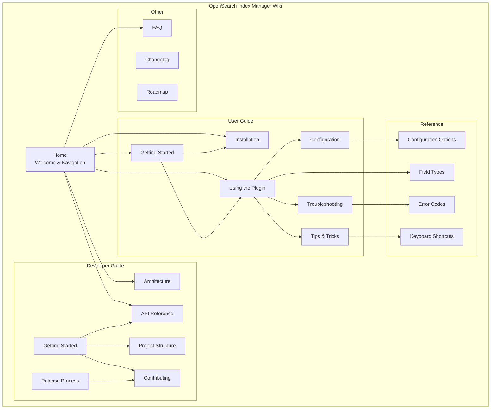
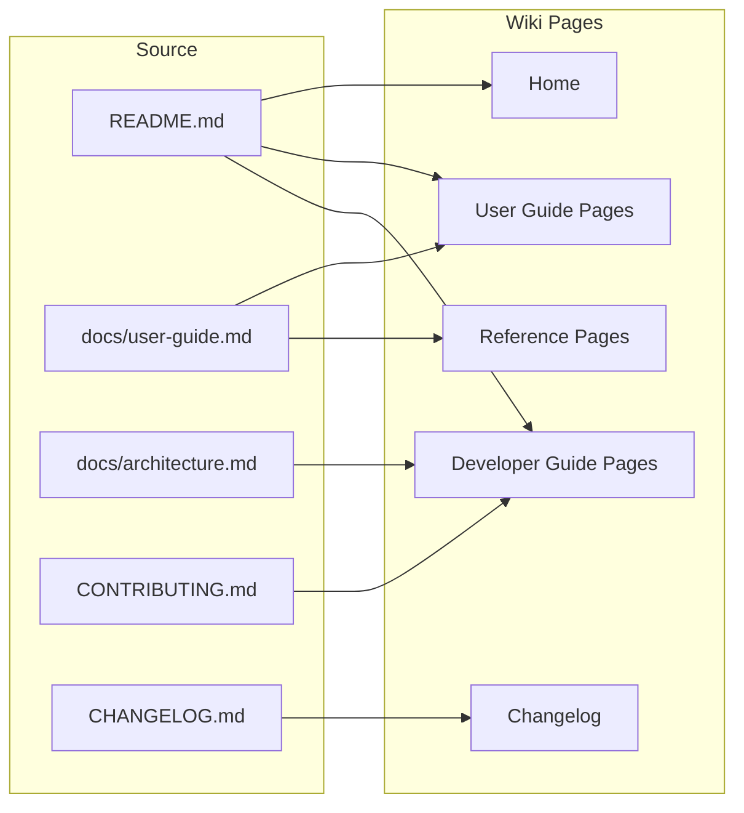
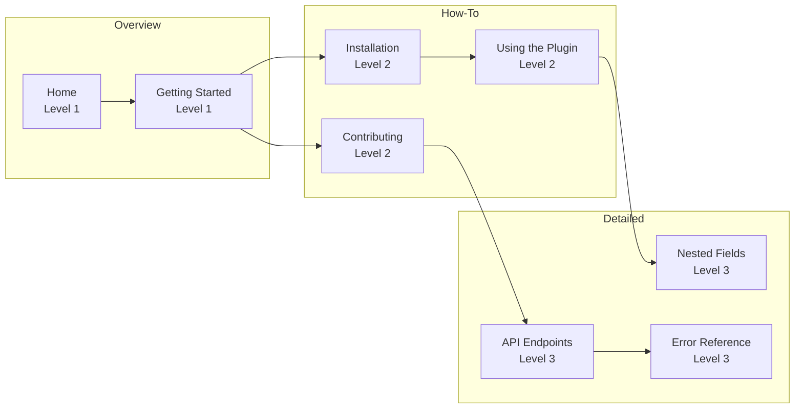
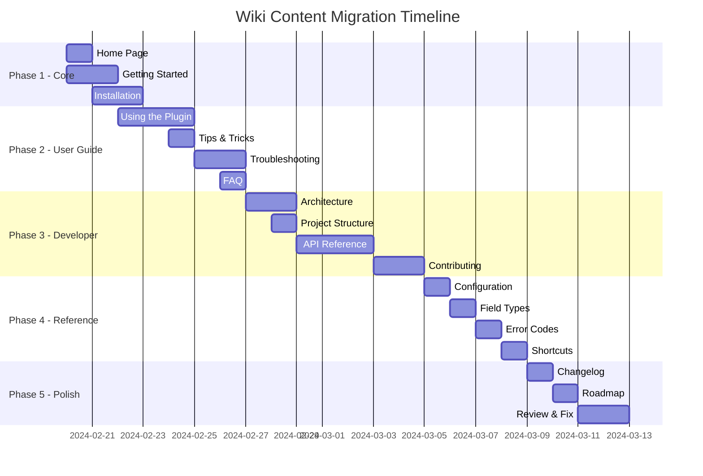

# Wiki Architecture Diagram

## Wiki Information Architecture

## Content Flow

## Page Detail Level

## Navigation Hierarchy

```mermaid
graph TD
    ROOT["Wiki Root"]
    
    ROOT --> HOME[" /Home " ]
    
    ROOT --> USERGUIDE[" /User-Guide " ]
    USERGUIDE --> UG_GETTING[" /User-Guide/Getting-Started " ]
    USERGUIDE --> UG_INSTALL[" /User-Guide/Installation " ]
    UG_INSTALL --> INST_RELEASE[" .../From-GitHub-Release " ]
    UG_INSTALL --> INST_SOURCE[" .../From-Source " ]
    UG_INSTALL --> INST_DOCKER[" .../Using-Docker " ]
    USERGUIDE --> UG_USING[" /User-Guide/Using-the-Plugin " ]
    UG_USING --> USE_INDEX[" .../Index-Selection " ]
    UG_USING --> USE_DOC[" .../Document-Management " ]
    UG_USING --> USE_NESTED[" .../Nested-Field-Editing " ]
    UG_USING --> USE_SEARCH[" .../Search-Functionality " ]
    UG_USING --> USE_MAPPING[" .../Mapping-Viewer " ]
    
    ROOT --> DEVGUIDE[" /Developer-Guide " ]
    DEVGUIDE --> DEV_ARCH[" /Developer-Guide/Architecture " ]
    DEVGUIDE --> DEV_START[" /Developer-Guide/Getting-Started " ]
    DEVGUIDE --> DEV_STRUCTURE[" /Developer-Guide/Project-Structure " ]
    DEVGUIDE --> DEV_API[" /Developer-Guide/API-Reference " ]
    DEV_API --> API_INDEX[" .../Index-Endpoints " ]
    DEV_API --> API_DOC[" .../Document-Endpoints " ]
    DEV_API --> API_SEARCH[" .../Search-Endpoints " ]
    DEVGUIDE --> DEV_CONTRIB[" /Developer-Guide/Contributing " ]
    DEVGUIDE --> DEV_RELEASE[" /Developer-Guide/Release-Process " ]
    
    ROOT --> REFERENCE[" /Reference " ]
    REFERENCE --> REF_CONFIG[" /Reference/Configuration-Options " ]
    REFERENCE --> REF_TYPES[" /Reference/Field-Types " ]
    REFERENCE --> REF_ERRORS[" /Reference/Error-Codes " ]
    REFERENCE --> REF_SHORTCUTS[" /Reference/Keyboard-Shortcuts " ]
    
    ROOT --> FAQ[" /FAQ " ]
    ROOT --> CHANGELOG[" /Changelog " ]
    ROOT --> ROADMAP[" /Roadmap " ]
```

## Migration Timeline

## Content Reuse Mapping

| Wiki Page | Primary Source | Secondary Sources | Notes |
|-----------|----------------|---------------------|-------|
| Home | README.md | - | Condensed overview |
| Getting Started | docs/user-guide.md (lines 1-72) | README.md (82-114) | Quick start guide |
| Installation | README.md (116-156) | - | Multiple methods |
| Index Selection | docs/user-guide.md (54-72) | - | Dropdown usage |
| Document CRUD | docs/user-guide.md (75-243) | - | Create, edit, delete |
| Nested Fields | docs/user-guide.md (246-331) | - | Deep dive needed |
| Configuration | README.md (163-185) | - | YAML config options |
| Troubleshooting | docs/user-guide.md (574-648) | - | Common issues |
| Architecture | docs/architecture.md (1-87) | - | High-level diagrams |
| Project Structure | docs/architecture.md (88-170) | README.md (336-356) | Directory layout |
| API Reference | docs/architecture.md (261-346) | - | All endpoints |
| Contributing | CONTRIBUTING.md | - | Split into sub-pages |
| Configuration Ref | README.md (163-185) | - | Table format |
| FAQ | Various | - | Compiled from issues |
| Changelog | CHANGELOG.md | - | Release history |
